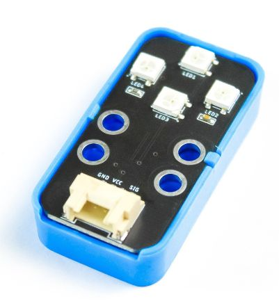
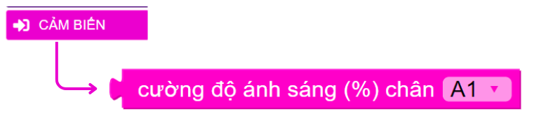

3. Đèn thông minh
======

1. Mục tiêu
-----
--------

Chúng ta hãy cùng lập trình một chiếc đèn thông minh, có thể bật tắt tự động dựa vào ánh sáng nhé. Cụ thể, khi trời tối (độ sáng < 30%) thì đèn sẽ tự bật. Ngược lại, khi trời sáng thì đèn sẽ tự tắt.

2. Thiết bị cần sử dụng
---------
----------

- Mạch Yolo UNO:

..  image:: images/yolo_uno.png
    :scale: 60%
    :align: center 
|

- Module led RGB kèm dây tín hiệu: 

|

- Module cảm biến ánh sáng kèm dây tín hiệu:

..  image:: images/cb_anh_sang.png
    :scale: 90%
    :align: center 
|

3. Kết nối phần cứng
-------
--------

- Module Led RGB kết nối vào cổng D5 - D6

- Module cảm biến ánh sáng kết nối vào cổng A0 - A1

    Cảm biến ánh sáng có giá trị trả về là analog, do đó bạn có thể kết nối với các chân P0, P1, P2 trên mạch mở rộng

4. Chương trình lập trình
------
------

- **Câu lệnh điều kiện:**

Trong phần này, chúng ta sẽ dùng đến khối lệnh điều kiện trong mục LOGIC:

..  image:: images/den_thong_minh_2.png
    :scale: 90%
    :align: center 
|
    
Câu lệnh đọc kết quả của cảm biến ánh sáng: 

|

- **Chương trình lập trình:**

|

- **Giải thích chương trình:**  Sau khi thực hiện gửi chương trình lên Yolo UNO, đèn LED trên Yolo UNO sẽ chuyển sang đèn xanh. Hãy thử dùng tay che cảm biến ánh sáng, module 4 LED RGB sẽ bật đèn màu trắng, đồng thời cường độ sáng cũng được hiện lên trên màn hình LCD
