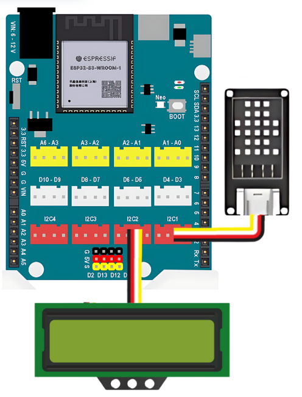
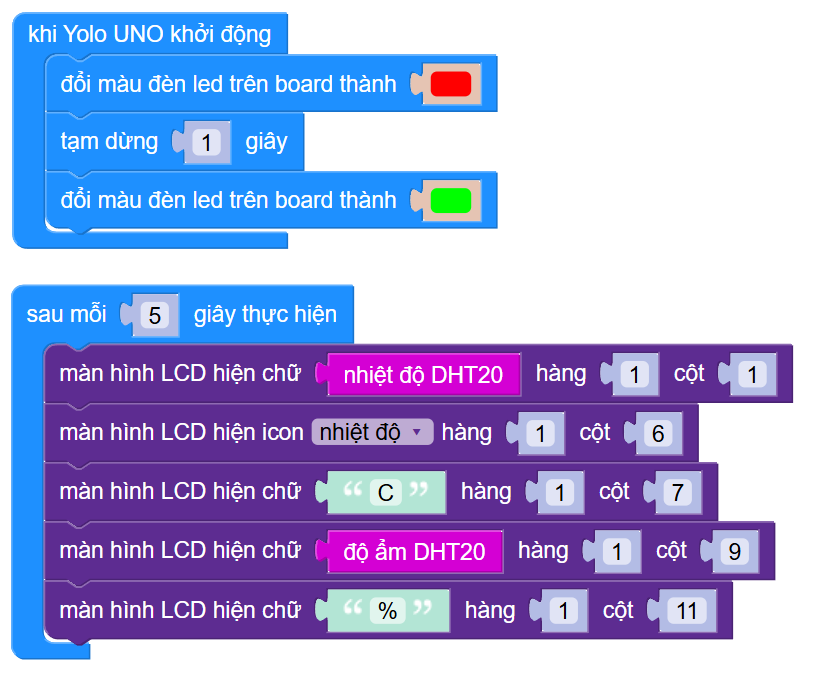

4. Đo và hiển thị nhiệt độ & độ ẩm
============

1. Mục tiêu
-----
--------

Đọc thông số nhiệt độ và độ ẩm không khí từ cảm biến DHT20 và hiển thị lên màn hình LCD 1602.

2. Thiết bị cần sử dụng
---------
----------

- Mạch Yolo UNO:

..  image:: images/yolo_uno.png
    :scale: 60%
    :align: center 
|

- Module LCD kèm dây tín hiệu: 

..  image:: images/lcd_1602.png
    :scale: 50%
    :align: center 
|

- Cảm biến nhiệt độ độ ẩm DHT20 kèm dây tín hiệu:

..  image:: images/dht20.png
    :scale: 60%
    :align: center 
|

3. Kết nối phần cứng
-------
--------

- Kết nối cảm biến DHT20 vào cổng I2C1 của Yolo UNO

- Kết nối LCD vào cổng I2C2
 

|

4. Chương trình lập trình
------
------

- Các khối lệnh để đọc thông số nhiệt độ hoặc độ ẩm của cảm biến DHT20, nằm trong mục **CẢM BIẾN**

..  image:: images/dht20_2.png
    :scale: 90%
    :align: center 
|

- **Chương trình lập trình:**

    `<https://app.ohstem.vn/#!/share/yolouno/2vFY26QwrHuFoL2nqydhVI7auVH>`_

- **Giải thích chương trình:**  Sau mỗi 5 giây, thông tin nhiệt độ độ ẩm sẽ được cập nhật lên màn hình LCD1602.