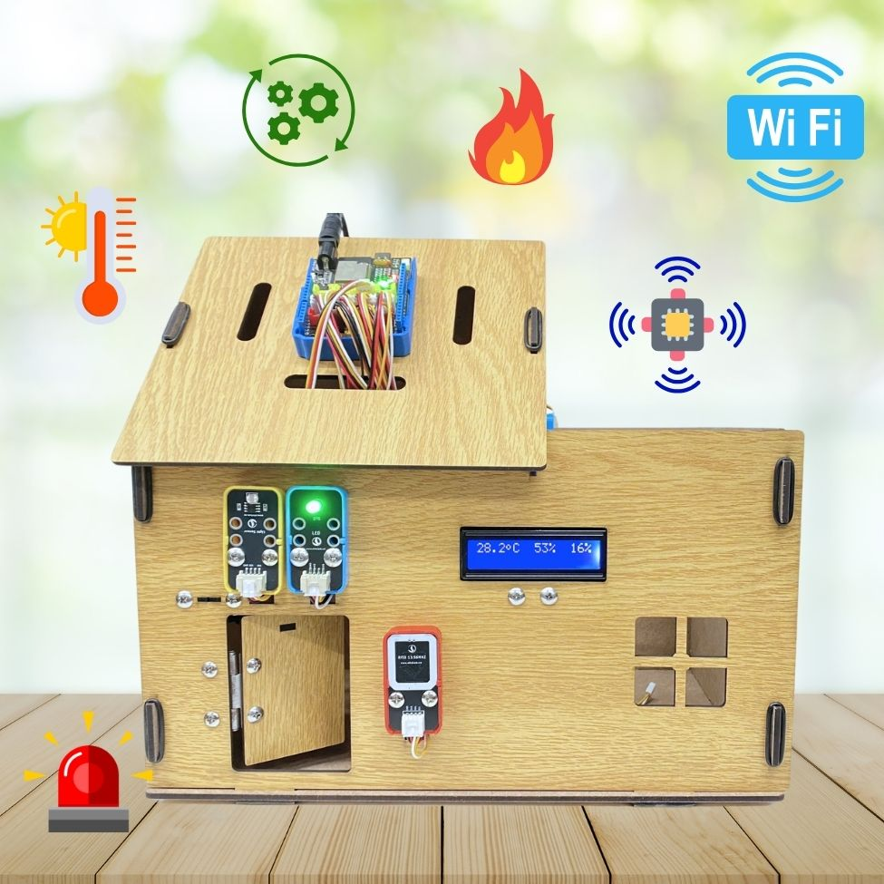

1. Giới thiệu
==========

1. Tổng quan dự án 
----------
----------

Smart Home (nhà thông minh) là hệ thống tự động hóa giúp giám sát và điều khiển các thiết bị trong nhà như đèn, quạt, máy lạnh, cửa ra vào… thông qua các phương thức như smartphone, giọng nói hoặc cảm biến. Hệ thống này mang lại sự tiện lợi, tiết kiệm năng lượng và nâng cao chất lượng cuộc sống.

|

Trong dự án này, người học sẽ xây dựng một mô hình **Smart Home** cơ bản bằng cách sử dụng mạch Yolo UNO, các module cảm biến, và kết nối với server IoT của OhStem. Thông qua quá trình thực hành, người học sẽ hiểu cách lập trình, thu thập dữ liệu từ cảm biến và điều khiển thiết bị từ xa, qua đó nắm vững nguyên lý hoạt động của một hệ thống nhà thông minh.

2. Các thiết bị cần sử dụng 
---------
-----

Các thiết bị và chức năng của từng thiết bị trong dự án này như sau:

..  csv-table:: 
    :header: "STT", "Module", "Chức năng"
    :widths: 10, 15, 30

    1, "`Đèn 4 LED RGB <https://ohstem.vn/product/module-4-led-rgb/>`_", "Đèn chiếu sáng"
    2, "`Đèn LED đơn <https://ohstem.vn/product/den-led-don/>`_", "Bật tắt đèn"
    3, "`Nút nhấn đôi <https://ohstem.vn/product/nut-nhan-doi/>`_", "Bật tắt đèn tự động theo độ sáng"
    4, "`Cảm biến ánh sáng <https://ohstem.vn/product/cam-bien-anh-sang/>`_", "Theo dõi ánh sáng của môi trường"
    5, "`Cảm biến DHT20 <https://ohstem.vn/product/cam-bien-dht20/>`_", "Theo dõi nhiệt độ và độ ẩm của môi trường"
    6, "`Màn hình LCD1602 <https://ohstem.vn/product/man-hinh-lcd-1602/>`_", "Hiển thị các thông tin quan trắc môi trường"
    7, "`Quạt mini <https://ohstem.vn/product/dong-co-quat-mini/>`_", "Quạt thông minh dựa trên nhiệt độ"
    8, "`Động cơ servo <https://ohstem.vn/product/servo-micro-9g/>`_", "Đóng mở cửa"
    9, "RFID", "Khóa cửa thông minh bằng thẻ từ"
    10, "`Yolo UNO <https://ohstem.vn/product/yolo-uno/>`_", "Mạch điều khiển các thiết bị hoạt động"
    11, "`Pin <https://ohstem.vn/product/pin-sac-2s-dung-cho-robot-orc-k2/>`_", "Cấp nguồn"

Ngoài ra bạn đọc có thể tìm hiểu chi tiết hơn về mô hình dự án Smart Home với Yolo UNO `tại đây <https://ohstem.vn/product/kit-stem-smart-home-tuy-chinh-tu-yolo-uno/>`_. 

3. Hướng dẫn lắp ráp 
---------
----------

Đang cập nhật 