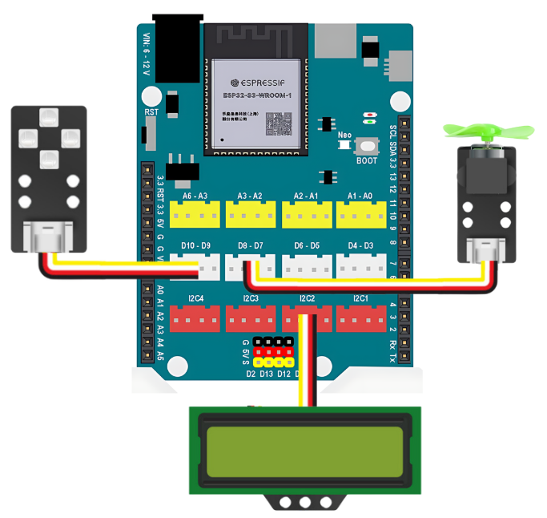
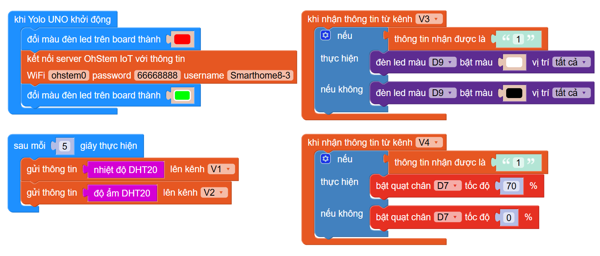
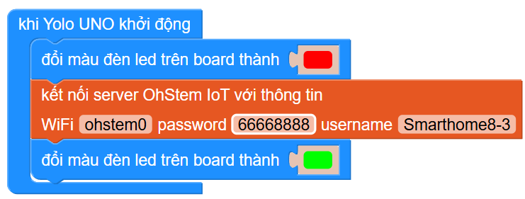
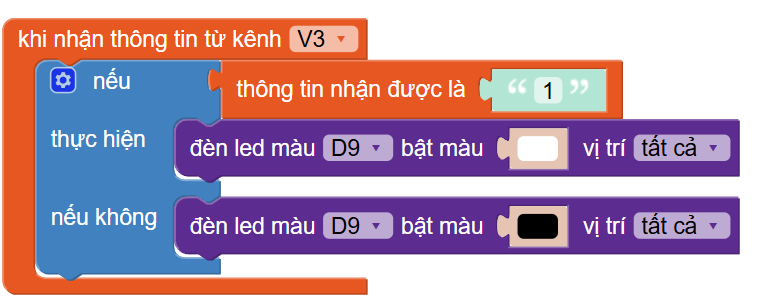

5. Nhận và gửi thông tin lên server IoT
========

1. Mục tiêu
-----
--------

Với hướng dẫn này, chúng ta sẽ thực hiện dự án gửi thông tin nhiệt độ, độ ẩm nhận được từ cảm biến DHT20 lên bảng điều khiển IoT và thực hiện điều khiển đèn, quạt từ xa thông qua bảng điều khiển IoT. 

2. Thiết bị cần sử dụng
---------
----------

- Mạch Yolo UNO:

..  image:: images/yolo_uno.png
    :scale: 60%
    :align: center 
|

- Cảm biến nhiệt độ độ ẩm DHT20 kèm dây tín hiệu:

..  image:: images/dht20.png
    :scale: 90%
    :align: center 
|

- Module 4 LED RGB:

..  image:: images/tiny_rgb.png
    :scale: 90%
    :align: center 
|

- Module quạt mini:

..  image:: images/mini_fan.png
    :scale: 90%
    :align: center 
|

3. Kết nối 
-----
--------

- Kết nối cảm biến DHT20 vào chân I2C trên Yolo UNO, 4 LED RGB ở chân D5-D6, quạt mini ở chân D7-D8: 
 

|

4. Tạo bảng điều khiển IoT
-------
--------

Truy cập vào `<https://app.ohstem.vn/>`_, chọn **Bảng điều khiển IoT** và tạo một bảng điều mới.

Với bảng điều khiển mới, bạn cần thực hiện các thao tác sau:

    1. Đặt lại tên cho Username (đặt thêm ký tự hoặc số để không trùng với các username khác)

|

2. Kéo thả các widget ra màn hình bảng điều khiển. Đặt lại tên của widget và kênh thông tin (Mỗi đối tượng sẽ chọn 1 kênh thông tin khác nhau)
        
    - Nhiệt độ - Kênh thông tin V1. 
    - Độ ẩm - Kênh thông tin V2. 
    - Bật tắt đèn - Kênh thông tin V3. 
    - Bật tắt quạt - Kênh thông tin V4.

|

Kết quả như sau:

|

|
5. Chương trình lập trình
-------
--------

**5.1 Giới thiệu khối lệnh**
----------

1. Mở tab mới và truy cập vào `<https://app.ohstem.vn/>`_. Chọn thiết bị lập trình **Yolo UNO** và chọn **Lập trình**.  

|

2. Vào mục **Nâng cao**, chọn danh mục khối lệnh **IoT**:

|

Chúng ta sẽ sử dụng các khối lệnh sau: 

- Câu lệnh dùng để kết nối wifi và kết nối đến user đã đặt trong mục Huấn luyện mô hình AI. 

|

- Câu lệnh gửi kết quả từ thiết bị lên bảng điều khiển

|

- Câu lệnh nhận thông tin từ kênh dữ liệu của server để điều khiển thiết bị hoạt động. 

|

- Câu lệnh dùng để so sánh kết quả thông tin thiết bị nhận được từ server.

|

**5.2 Viết chương trình**
----------

Thực hiện các thao tác sau để mở chương trình **Nhận và gửi thông tin lên server**:

|

**5.3 Giải thích chương trình**
----------

- **Bước 1:** Lập trình để Yolo UNO kết nối wifi. Cần nhập đúng tên, mật khẩu wifi mà máy tính/ điện thoại đang kết nối và username của bảng điều khiển. 

|

Giải thích: Khi Yolo UNO khởi động, đèn LED trên board sẽ đổi màu đỏ. Sau khi kết nối thành công với wifi và bảng điều khiển IoT, đèn LED trên board sẽ sáng xanh. 

- **Bước 2:** Gửi thông tin lên bảng điều khiển

|

Giải thích: Sau mỗi 5 giây, thông tin từ cảm biến nhiệt độ và độ ẩm sẽ gửi kết quả lên bảng điều khiển. 

- **Bước 3**:  Điều khiển đèn LED trên board từ bảng điều khiển IoT:

|

- **Bước 4**:  Điều khiển quạt trên board từ bảng điều khiển IoT:

|

Giải thích: Sau mỗi 5 giây, thông tin từ cảm biến nhiệt độ và độ ẩm sẽ gửi kết quả lên bảng điều khiển. 

- **Bước 4**: Kết nối đến Yolo UNO và quan sát kết quả trên bảng điều khiển. 
