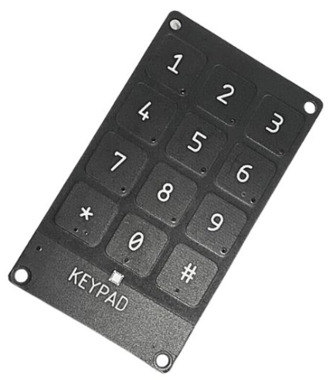
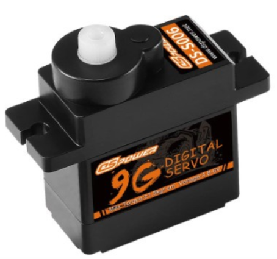
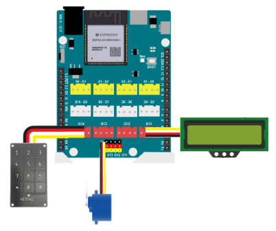
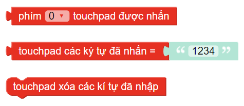
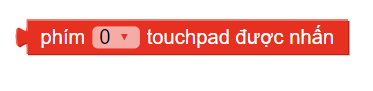
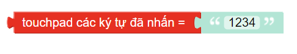
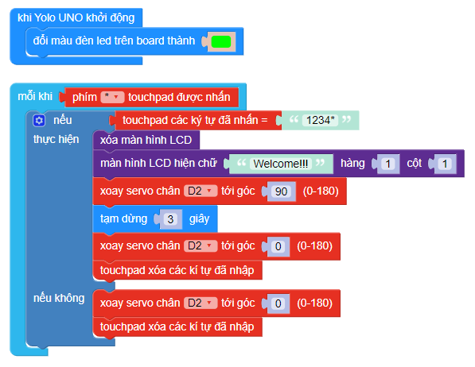

4. Khóa mật khẩu
=========

1. Mục tiêu
-----
--------

Với hướng dẫn này, chúng ta thực hiện tính năng mở khóa cửa bằng mật khẩu, sử dụng bàn phím keypad4x3.

2. Thiết bị cần sử dụng
---------
----------

- Mạch Yolo UNO:

..  image:: images/yolo_uno.png
    :scale: 60%
    :align: center 
|

- Bàn phím cảm ứng diện dung 

|

- Động cơ servo:

|

- Màn hình LCD: 

..  image:: images/lcd_1602.png
    :scale: 50%
    :align: center 
|

3. Kết nối phần cứng
-------
--------

- Kết nối bàn phím cảm ứng ở cổng I2C.

- Kết nối động cơ servo vào chân D2.

- Kết nối màn hình LCd vào cổng I2C. 

|

4. Chương trình lập trình
------
------

- **Giới thiệu khối lệnh:**

|
    
*Các câu lệnh sử dụng cho tính năng mở mật khẩu*

|

*Câu lệnh kiểm tra phím được nhấn*

|

*Câu lệnh kiểm tra các phím đã được nhấn*

|

*Câu lệnh xóa các phím đã được nhấn*

Với hình kết nối trên, động cơ servo chân D2 gắn với cánh cửa để làm cửa tự động ra vào.
- **Chương trình lập trình:**

|

