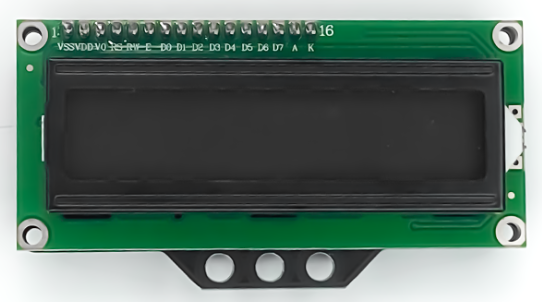
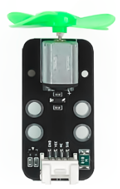
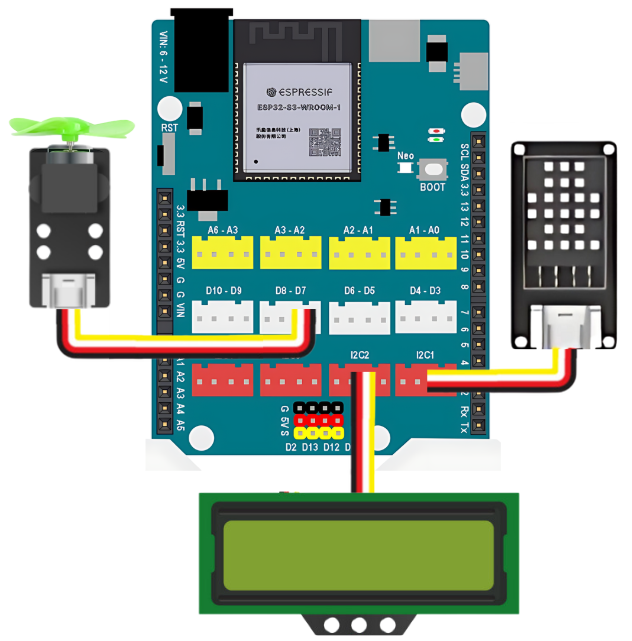
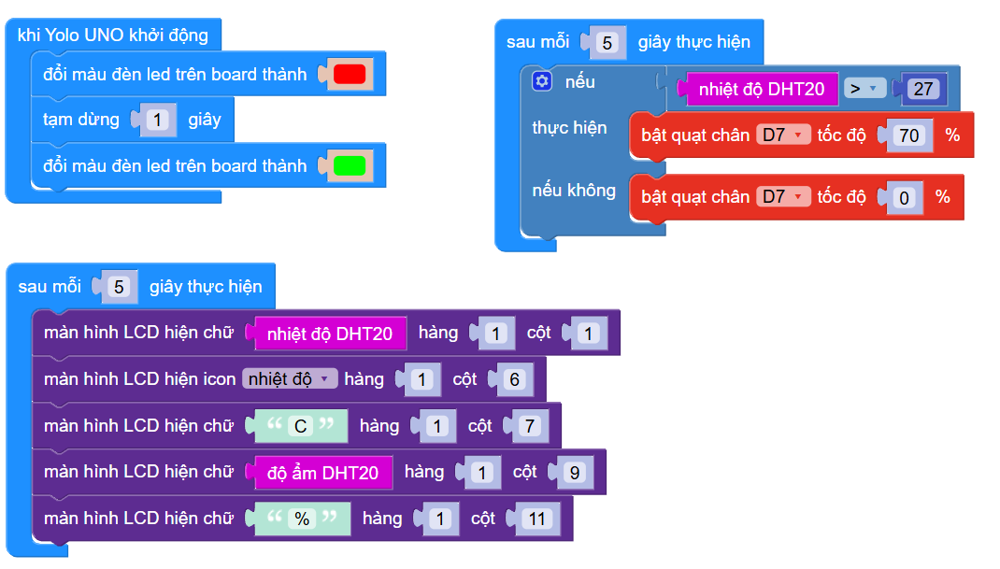

2. Quạt thông minh 
=======

1. Mục tiêu
-----
--------

Tiếp theo, chúng ta sẽ cùng nâng cấp dự án lên 1 cấp độ phức tạp hơn, kết hợp cảm biến DHT20 với màn hình LCD và quạt mini. Thực hiện dự án **Quạt thông minh**, tự hoạt động dựa vào nhiệt độ của môi trường. 

Cụ thể, hệ thống sẽ hoạt động bằng cách kiểm tra dựa vào nhiệt độ mà cảm biến DHT20 gửi về **sau mỗi 5 giây**: 

- Thông tin nhiệt độ và độ ẩm của không khí được hiển thị lên LCD

- Nếu nhiệt độ lớn hơn 27 độ thì quạt sẽ bật

- Nếu nhiệt độ nhỏ hơn 27 độ thì quạt sẽ tắt

2. Thiết bị cần sử dụng
---------
----------

- Mạch Yolo UNO:

..  image:: images/yolo_uno.png
    :scale: 60%
    :align: center 
|

- Module led RGB kèm dây tín hiệu: 

|

- Cảm biến nhiệt độ độ ẩm DHT20 kèm dây tín hiệu:

..  image:: images/dht20.png
    :scale: 90%
    :align: center 
|

- Module quạt mini kèm dây tín hiệu: 

|

3. Kết nối phần cứng
-------
--------

- Màn hình LCD và cảm biến DHT20 kết nối vào cổng I2C1 và I2C2

- Module quạt kết nối vào cổng D7 - D8

|

4. Chương trình lập trình
------
------

- **Giới thiệu khối lệnh:**

..  image:: images/dht20_2.png
    :scale: 90%
    :align: center 
|
    
Câu lệnh bật tắt quạt với các mức độ khác nhau từ 0 đến 100 %.

- **Chương trình lập trình:**

|

