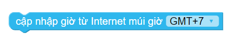
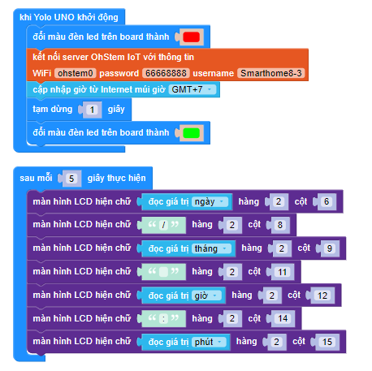

8. Đồng hồ thời gian thực
=======

1. Mục tiêu
-----
--------

Tiếp theo, chúng ta sẽ cùng nâng cấp dự án lên 1 cấp độ phức tạp hơn, kết hợp chức năng thời gian từ internet.

2. Chương trình lập trình
------
------

- Câu lệnh cập nhật thời gian từ internet với múi giờ +7, nằm trong danh mục **LẬP LỊCH**

|

- **Chương trình lập trình:**

    `<https://app.ohstem.vn/#!/share/yolouno/2vFeghwgWxzbX73vdCBfyoPsN6F>`_
|

