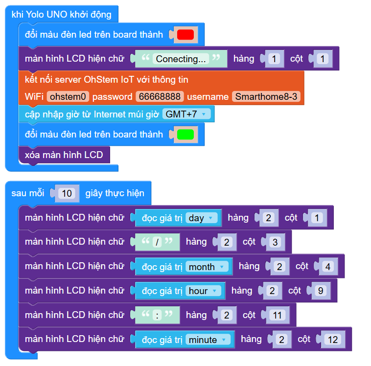

6. Đồng hồ thời gian thực
=======

1. Mục tiêu
-----
--------

Tiếp theo, chúng ta sẽ cùng nâng cấp dự án lên 1 cấp độ phức tạp hơn, kết hợp chức năng thời gian từ internet.

2. Chương trình lập trình
------
------

- **Giới thiệu khối lệnh:**

..  image:: images/time01.png
    :scale: 90%
    :align: center 
|
    
Câu lệnh cập nhật thời gian từ internet với múi giờ +7.

- **Chương trình lập trình:**

|

