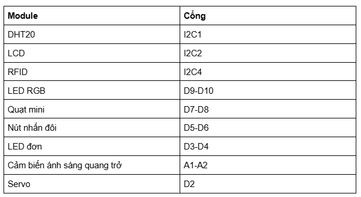
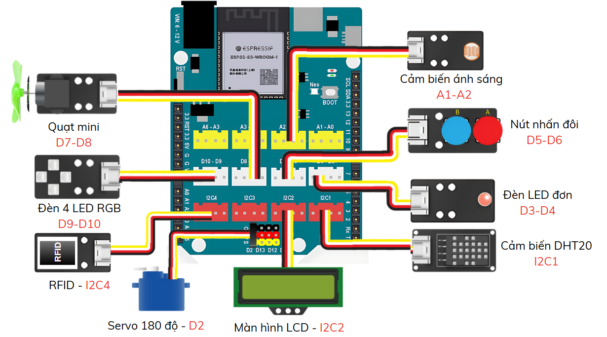

9. Tổng kết
============

1. Mục tiêu
-----
--------

Ở các phần trước, bạn đã làm quen với các module và cách lập trình điều khiển chúng một cách đơn giản. Trong phần này, chúng ta sẽ ứng dụng những kiến thức đã học để xây dựng một mô hình nhà thông minh hoàn chỉnh, tích hợp nhiều chức năng tự động hóa, bao gồm:

- **Hệ thống chiếu sáng thông minh**

    - Bật/tắt đèn bằng **nút nhấn đôi**

    - **Đèn thông minh** – tự động bật/tắt dựa vào **cảm biến ánh sáng**

- **Hệ thống làm mát tự động**

    - **Quạt thông minh** – tự động điều chỉnh theo **nhiệt độ và độ ẩm** môi trường

- **Hệ thống kiểm soát ra vào**

    - **Cửa thông minh** – sử dụng **thẻ từ** để đóng/mở cửa an toàn

- **Kết nối và điều khiển từ xa**

    - **Nhận và gửi dữ liệu** lên **server IoT** để giám sát và điều khiển thiết bị từ xa

Với những chức năng này, mô hình sẽ mô phỏng một hệ thống Smart Home cơ bản, giúp bạn hiểu cách ứng dụng lập trình và cảm biến trong thực tế.

2. Kết nối phần cứng
-------
--------

Bảng tổng hợp các chân kết nối như sau: 

|

|

3. Chương trình lập trình
------
------

Link chương trình tổng thể cho dự án Smarthome với IoT :

`<https://app.ohstem.vn/#!/share/yolouno/2vFjbxeAluaGYAmf7bg32U4OO7X>`_