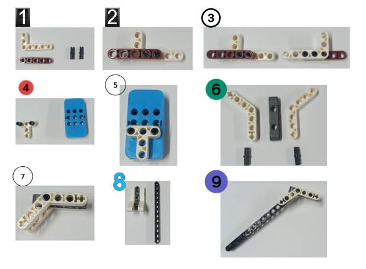
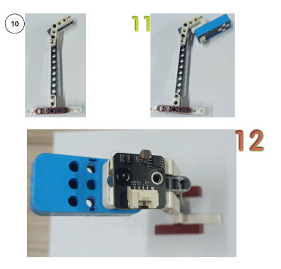
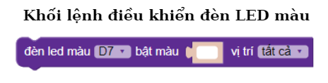
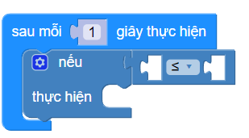
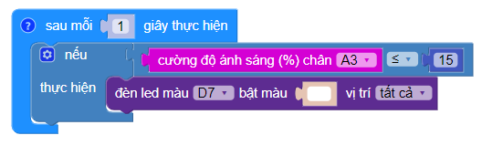
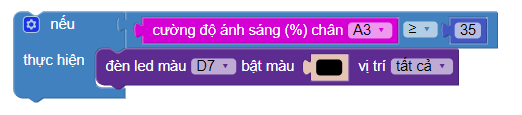
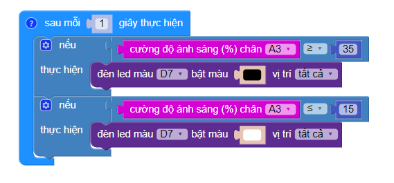

2. Bài 1: Đèn công cộng thông minh
=================================

1. Mục tiêu:
------------
-----------------

Trong bài này, chúng ta sẽ cùng lập trình một chiếc đèn thông minh có thể tự sáng vào buổi tối. Các đèn này có thể gắn vào các khu vui chơi hoặc công viên tùy thích.

2. Kết nối 
----------
--------------

- Cảm biến ánh sáng (A3)

    .. image:: images/bai_1.1.3.png
        :width: 150px
        :align: center 
    |
- Module 4 LED RGB (D7-D8)

    .. image:: images/bai_1.1.1.png
        :width: 150px
        :align: center 
    |
- **Kết nối:**

    .. image:: images/bai_1.2.png
        :scale: 80%
        :align: center 
|

3. Lắp ráp 
-----------
----------------

Các thao tác được thực hiện như sau:

|

|

4. Giới thiệu khối lệnh
----------
----------------

- Khối lệnh của cảm biến ánh sáng

|

- Khối lệnh điều khiển đèn 4 LED RGB:

|

Viết chương trình
------------
--------------------

1. Kéo khối lệnh điều kiện vào khối lệnh kiểm tra theo thời sau **Sau mỗi 1 giây thực hiện**

|

2. Tạo điều kiện: nếu trời tối (độ sáng < 15) thì sẽ bật đèn (đổi sang thành màu trắng)

|

3. Tạo điều kiện: nếu trời sáng (độ sáng > 35) thì sẽ tắt đèn (đổi sang thành màu đen)

|

- Chương trình hoàn thiện: 

|

- Link chương trình mẫu: `<https://app.ohstem.vn/#!/share/yolouno/2eImrFzleAHhhnxEm7l7IBnN7zU>`_

