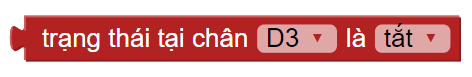

4. Bài 3: Thùng rác thông minh
==================================

1. Mục tiêu 
--------------
-------------

Một thùng rác thông minh với khả năng tự động mở nắp khi có người đến gần sẽ mang lại sự tiện lợi hơn rất nhiều, giúp thành phố xanh sạch đẹp hơn. Trong bài này, chúng ta hãy cùng lập trình một thùng rác có khả năng tự mở nắp khi có người và tự động báo hiệu khi thùng rác đầy nhé

2. Kết nối 
-----------
--------------

- Cảm biến vật cản (D3-D4)

|    

- Động cơ Servo (D2)

.. image:: images/cityuno1_3.PNG
    :scale: 80%
    :align: center 
|

**Lưu ý:** Chỉnh góc Servo về góc 20 trước khi lắp ráp 

- **Kết nối**

.. image:: images/bai_3.4.png
    :scale: 90%
    :align: center 
|

3. Lắp ráp mô hình 
-------------
---------------

|

4. Giới thiệu khối lệnh 
-------------------
-----------------------

- Khối lệnh xác định trạng thái cảm biến vật cản

| 

5. Viết chương trình 
-------------
-------------------

1. Quay Servo chân D2 đến góc 20 độ (đóng nắp thùng rác)

|

2. Tạo điều kiện: nếu cảm biến vật cản phát hiện có người phía trước cảm biến

|

3. Sau 3 giây, ta đóng nắp thùng rác (quay Servo về góc 20 độ)

|

6. Chương trình mẫu 
---------------
-----------------

- Thùng rác thông minh 

|

Link chương trình: `<https://app.ohstem.vn/#!/share/yolouno/2eIjitx56J35MpcX2K4P0NShqIF>`_

