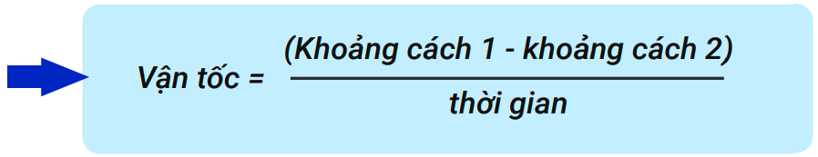
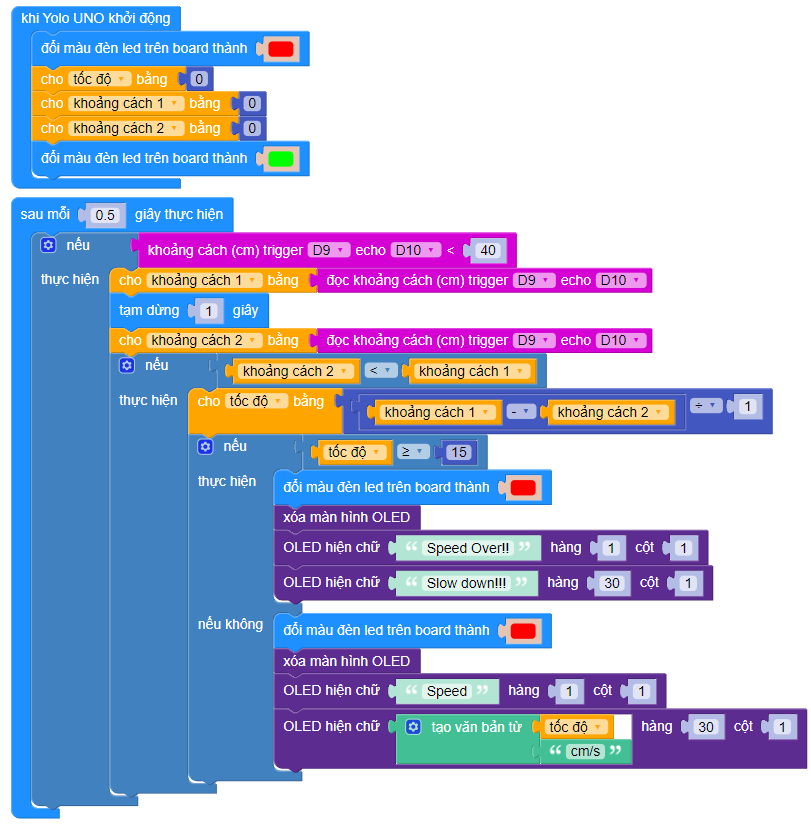

5. Bài 4: Hệ thống cảnh báo tốc độ
=================================

1. Mục tiêu 
----------
--------------

Trong thành phố, di chuyển vượt tốc độ là hành vi vi phạm. Vì vậy, thiết bị đo tốc độ rất cần thiết để kiểm tra tốc độ chạy của xe. Nếu tốc độ của xe vượt mức quy định, hệ thống sẽ hiển thị cảnh báo và yêu cầu xe phải giảm tốc độ. 

2. Kết nối
----------
--------------

- Cảm biến khoảng cách (D9-D10)

|

- Màn hình LCD OLED (I2C)

.. image:: images/cityuno4_2.PNG
    :width: 150px
    :align: center 
|

- **Kết nối**

.. image:: images/bai_5.3.png
    :scale: 80%
    :align: center 
|

3. Lắp ráp mô hình 
-------------
---------------

|
    

4. Giới thiệu khối lệnh 
--------------
----------------

- Vào mục **Mở rộng**, tải thư viện **Màn hình OLED**: 

|

- Câu lệnh cảm biến khoảng cách

|

5. Cách tính vận tốc 
----------
-------------

.. image:: images/bai_5.7.png
    :scale: 90%
    :align: right

Để tính vận tốc xe, chúng ta sẽ sử dụng công thức sau:
 
    **v = S / t**

Trong đó:
    - v là vận tốc 
    - S là quãng đường
    - t là thời gian

Ta sẽ tiến hành đo khoảng cách đến xe trong 2 mốc thời gian khác nhau, từ đó tính ra quãng đường xe đi được:

    **S = Khoảng cách 1 - Khoảng cách 2**

    **Thời gian di chuyển = thời gian giữa 2 mốc thời gian**

|

6. Viết chương trình 
----------
------------

1. Tạo 3 biến để chứa giá trị tốc độ, khoảng cách 1 và khoảng cách 2. Gán giá trị 0 cho các biến này

|

2.  Nếu phát hiện có xe đến gần (khoảng cách < 40cm), tiến hành đo khoảng cách tại 2 thời điểm cách nhau 1 giây và lưu giá trị vào biến tương ứng:

|

3. Lồng điều kiện nếu xe đang tiến lại gần (khoảng cách 2 < khoảng cách 1) vào bên trong Áp dụng công thức tính vận tốc vào và gán giá trị tính được vào biến tốc độ (thời gian là 1 giây):

|

4. Nếu tốc độ quá hạn mức quy định (15), ta tiến hành bật đèn LED thành màu đỏ và xóa màn hình LCD:

|

5. In dòng chữ “Speed Over - Slowdown!” :

|

6. Nếu tốc độ không vượt mức 15, bật đèn LED thành màu xanh và hiển thị giá trị tốc độ lên màn hình LCD

|

7. Chương trình mẫu 
---------------
-----------------

- Hệ thống cảnh báo tốc độ: 

|

- Link chương trình: `<https://app.ohstem.vn/#!/share/yolouno/2eIjFbMvDmdEnI63RUErkGLp9Iv>`_

