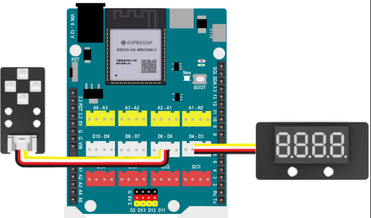
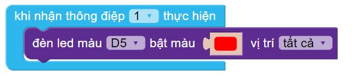
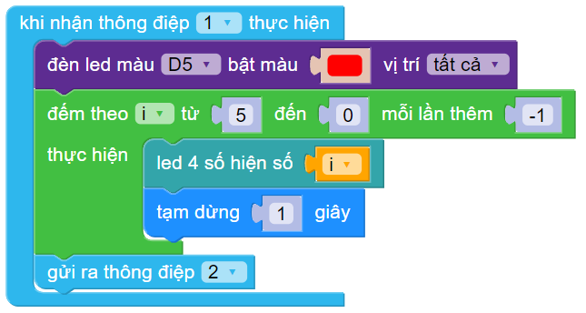
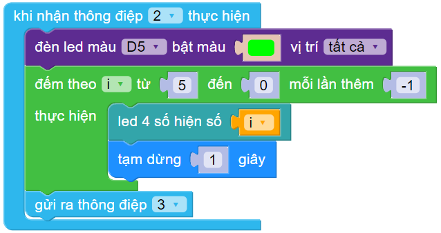
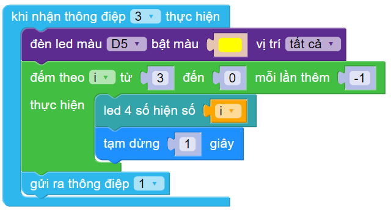
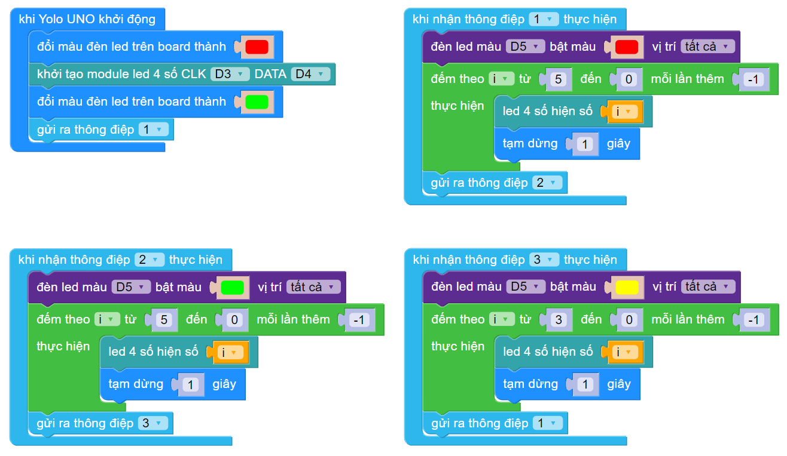

6. Bài 5: Đèn giao thông
===================================

1. Mục tiêu 
----------
---------------

Trong bài học này, chúng ta sẽ cùng làm một hệ thống mô phỏng đèn giao thông thực tế.

2. Kết nối 
--------------
--------------------

- Đèn 4 LED RGB (chân D5)

|

- LED 4 kí số (chân D3-D4)

|

- **Kết nối:**

|

3. Lắp ráp mô hình 
------------
---------------

|

4. Giới thiệu khối lệnh 
----------
-----------------

- Vào thư mục **Mở rộng**, tải thư viện **LED 7 đoạn**:

|

- Câu lệnh khởi tạo LED 4 ký số: 

|

- Câu lệnh sự kiện lập lịch:

.. image:: images/cityuno5_3.PNG
    :scale: 80%
    :align: center 
|

5. Viết chương trình 
----------
-----------------

1. Gửi ra thông điệp 1 kích hoạt khối lệnh đèn giao thông:

|

2. Khi nhận được thông điệp 1 sẽ kích hoạt trạng thái đèn đỏ:

|

3. Tạo 1 vòng lặp đếm ngược từ 5 về 0 và hiện giá trị lên màn hình 4 số:

|

4. Sau đó gửi tiếp thông điệp 2 để sang trạng thái đèn xanh:

|

5. Thực hiện tương tự trang thái đèn đỏ cho trạng thái đèn xanh:

|

6. Sau đó sẽ gửi thông điệp 3 để chuyển sang màu vàng (đèn vàng 3 giây):

|

7. Sau khi đèn vàng 3 giây sẽ gửi thông điệp về thông điệp 1.

6. Chương trình mẫu 
-----------------
-------------------

- Đèn giao thông: 

|

- Link chương trình mẫu: `<https://app.ohstem.vn/#!/share/yolouno/2eIg8FXRMVHlsP7SxRLTgwywNfW>`_

