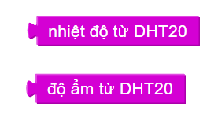
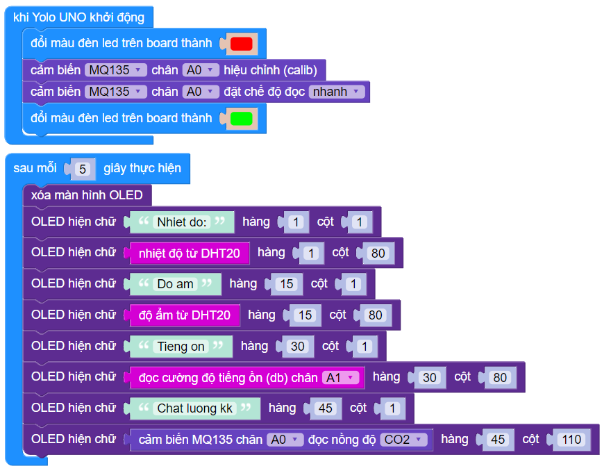

7. Bài 6: Hệ thống theo dõi chất lượng không khí và tiếng ồn
========================================

1. Mục tiêu
------------
------------------

Ở thành phố, chất lượng không khí là mối quan tâm hàng đầu.Tương tự, ô nhiễm tiếng ồn cũng là mối quan tâm hàng đầu cho sức khỏe người dân. Để đo lường và đưa ra giải pháp tương ứng, chúng ta hãy cùng lập trình một hệ thống để theo dõi chất lượng không khí và thời tiết nhé! Các giá trị này sẽ được hiển thị trên màn hình LCD.

2. Kết nối 
--------
--------------

- Cảm biến nhiệt độ độ ẩm DHT20 (I2C2)

|

- Cảm biến chất lượng không khí MQ-135 (A0)

|

- Cảm biến cường độ âm thanh (A1)

|

**Lưu ý:** Cảm biến chất lượng không khí sẽ ấm lên khi được cấp điện, đây là đặc tính đốt nóng không khí của thiết bị.

- Màn hình LCD OLED (I2C1)

|

- **Kết nối:**

|

3. Lắp ráp mô hình 
------------
---------------

|

|

4. Giới thiệu khối lệnh 
----------
-----------------

- Vào mục **Mở rộng**, tải 2 thư viện **OLED I2C** và **Cảm biến MQx**: 

| 

- Khối lệnh đọc nhiệt độ, độ ẩm từ cảm biến DHT20: 

|

- Khối lệnh đọc cường độ âm thanh:

|

- Khối lệnh khởi tạo cảm biến MQ135: 

|

- Khối lệnh đọc giá trị cảm biến MQ135: 

| 

5. Viết chương trình 
----------
-----------------

1. Sử dụng câu lệnh **sau mỗi 5 giây thực hiện**.

    .. image:: images/cityuno6_5.PNG
        :scale: 90%
        :align: center 
    |
2. Xóa màn hình LCD trước đó và in ra giá trị nhiệt độ, độ ẩm, chất lượng không khí (PPM), mức độ âm thanh lên màn hình LCD tại vị trí 3 hàng khác nhau:

    .. image:: images/cityuno6_6.PNG
        :scale: 60%
        :align: center 
    |

Chương trình mẫu 
-----------------
-------------------

- Hệ thống theo dõi thời tiết và chất lượng không khí: 

|

- Link chương trình mẫu: `<https://app.ohstem.vn/#!/share/yolouno/2eIhjgbTjsU5k53Lf3nqIP8k5bW>`_

