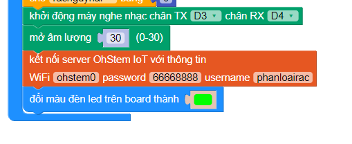
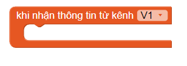
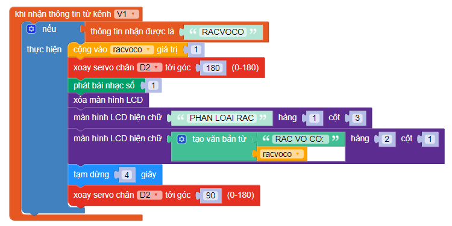
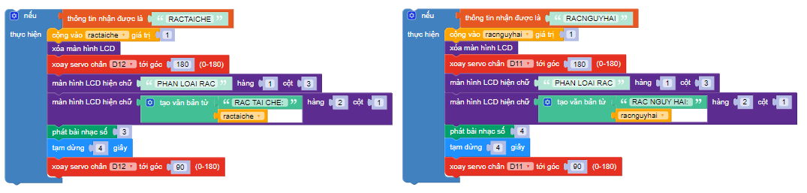

2. Thực hiện dự án: "Phân loại rác thải với Yolo UNO"
=================================

1. Mục tiêu:
------------
-----------------

Trong bài này, chúng ta sẽ cùng lập trình một hệ thống phân loại rác thải qua camera AI.

2. Kết nối 
----------
--------------

- Module camera AI version 2 (Chân D9-D10)

    .. image:: images/trash03.png
        :width: 150px
        :align: center 
    |
- Module SoundPlayer (D3-D4)

    .. image:: images/trash04.png
        :width: 150px
        :align: center 
    |
- Màn hình LCD1602 (I2C)

    .. image:: images/trash05.png
        :width: 150px
        :align: center 
    |
- 4 Servo 180 độ (D2-D11-D12-D13)
    .. image:: images/trash06.png
        :width: 150px
        :align: center 
    |
- **Kết nối:**

    .. image:: images/trash07.png
        :scale: 80%
        :align: center 
|

3. Thực hiện 
-----------
----------------
- Trước khi lắp ráp, bạn cần căn chỉnh Servo về góc 90 để hoạt động chính xác. Thực hiện như sau:

    1. Kết nối Servo vào chân D11 trên mạch Yolo UNO(thực hiện tương tự ở 3 chân servo còn lại)

    2. Kết nối Yolo UNO với Ohstem App và tiến hành lập trình.

    3. Tạo chương trình như hình minh họa

|

    4.  Nhấn nút chạy chương trình 

    5. Ngắt kết nối Servo với nguồn điện (tránh vừa cắm điện vừa gắn làm quay Servo gây hư hại thiết bị)

4. Giới thiệu khối lệnh
----------
----------------

- Khối lệnh của camera AI: 

|

- Khối lệnh điều khiển loa phát nhạc:

|

**Dự án này chúng ta sẽ thống nhất cách nhận kết quả phân loại rác qua IoT server OhStem**

5. Cấu hình cài đặt module camera AI/camera OhStem App:
-----------
----------------

- Bạn xem cách cấu hình/sử dụng tính năng camera AI tại link sau: `<https://docs.ohstem.vn/en/latest/robot_rover/camera_ai_v2.html>`_  

Viết chương trình
------------
--------------------

1. Đầu tiên sẽ cài đặt góc cho 4 servo về 90 độ (vị trí đóng nắp thùng)

|

2. Tạo 4 biến cho 4 loại rác thải, 4 biến này sẽ hiển thị trên màn hình lúc phân loại rác.

|

3. Khởi tạo Module phát nhạc tại chân D3-D4, mở âm lượng 30 (tối đa)

|

4. Kết nối wifi và server để nhận thông tin phân loại AI

|

5. Giả sử trong bước thiết lập cài đặt IoT của camera AI bạn gửi lên kênh V1. Vậy để thiết bị nhận thông tin điều khiển bạn cũng sẽ đăng ký kênh V1:

|

6. Chúng ta sẽ so sánh thông tin nhận được với loại rác mà mình đã đặt để phân loại, sử dụng câu lệnh Nếu:

|
7. Khi kết quả đúng, chúng ta sẽ cho servo quay đến góc mở (có thể là 180 hoặc 0 tùy theo bạn lắp servo)

|
8. Chúng ta cũng có thể hiện lên số lần phân loại rác tương ứng  bằng cách cho biến cộng vào 1 khi phân loại đúng và in ra màn hình

|

9. Thực hiện tương tự với 3 loại rác còn lại

|

|

- Link chương trình mẫu: `<https://app.ohstem.vn/#!/share/yolouno/2eKHUadDZMPoqT25fL3MQQUqevH>`_

