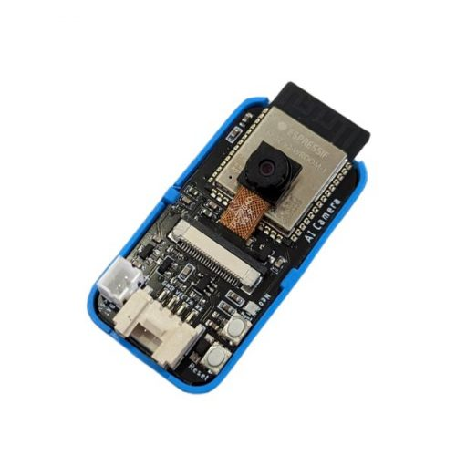
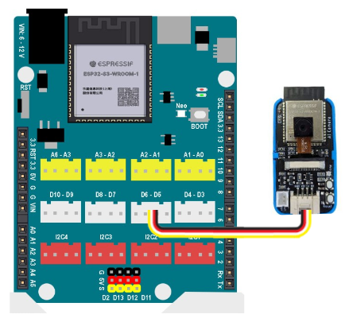
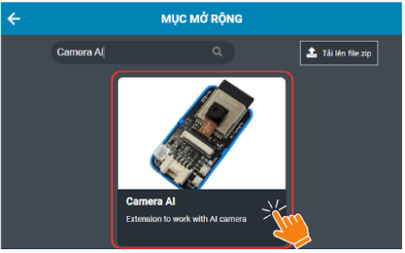
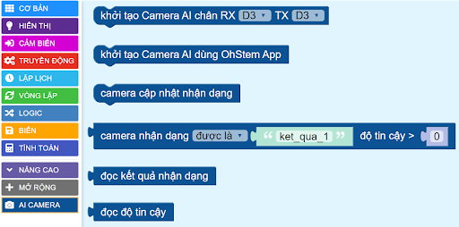
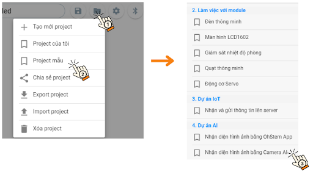
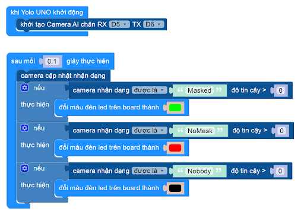

2. Nhận diện hình ảnh bằng Camera AI
==========

1. Mục tiêu
-----
--------

Với hướng dẫn này, chúng ta sẽ thực hiện dự án nhận diện hình ảnh với Camera AI. Nếu phát hiện có mang khẩu trang, Yolo UNO sẽ bật đèn xanh, bật đèn đỏ nếu không đeo khẩu trang. Ngược lại, thì tắt đèn. 

2. Thiết bị cần sử dụng
---------
----------

- Mạch Yolo UNO:

..  image:: images/yolo_uno.png
    :scale: 60%
    :align: center 
|

- Camera AI kèm dây tín hiệu: 

|

3. Kết nối 
-----
--------

- Kết nối camera AI vào chân D5 - D6 trên Yolo UNO: 
 

|

4. Huấn luyện mô hình AI
-------
--------

Xem hướng dẫn thực hiện **Huấn luyện mô hình** với module Camera AI ở mục 4.1 đến 4.3,  tại link sau: `<https://docs.ohstem.vn/en/latest/robot_rover/camera_ai_v2.html>`_ 

5. Chương trình lập trình
-------
--------

**5.1 Tải thư viện**
----------

Vào mục **Mở rộng** của **Yolo UNO**, tải thư viện **Camera AI**: 

|    

Các khối lệnh của danh mục khối lệnh Camera AI: 

|

**5.2 Viết chương trình**
----------

Thực hiện các thao tác sau để mở chương trình **Nhận diện hình ảnh bằng Camera AI**:

|

Chương trình hiển thị như sau: 

|

**5.3 Giải thích chương trình**
----------

Sau khi Yolo UNO khởi động, sẽ khởi tạo chân camera AI và liên tục cập nhật kết quả nhận dạng từ camera sau 0.1 giây: 

- Nếu camera nhận dạng được có đeo khẩu trang thì đổi đèn led thành xanh

- Nếu camera nhận dạng được không đeo khẩu trang thì đổi đèn led thành đỏ

- Nếu camera không phát hiện được 2 kết quả trên thì tắt đèn. 

