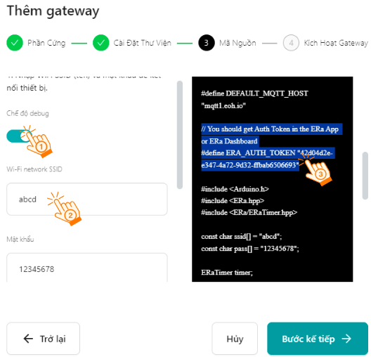

4. Yolo UNO với nền tảng E-RA IoT-EoH
=======

1. Sơ lược về E-Ra - IoT Platform
-------------
------

E-Ra IoT Platform là nền tảng IoT mở của người Việt, được phát triển và vận hành bởi đội ngũ EoH, giúp hỗ trợ, đồng hành và cho phép các nhà phát triển phần mềm và thiết bị IoT có thể theo dõi kết quả dự án trên giao diện đẹp mắt, đồng nhất và chuyên nghiệp (Web Dashboard/iOS và Android App). Ngoài ra với bộ thư viện được EoH phát triển sẽ giúp cho các nhà phát triển dễ dàng hơn trong việc kết nối các thiết bị IoT và quản lý chúng dễ như trở bàn tay. E-Ra IoT Platform là nền tảng IoT (Non-Code) giúp xóa bỏ những rào cản khó khăn khi tiếp cận và ứng dụng IoT vào thực tiễn (nông nghiệp, công nghiệp, nhà thông minh,...v.v).

2. Hướng dẫn sử dụng cơ bản E-Ra - IoT Platform:
--------
-------

2.1 Đăng ký tài khoản
---------

Hệ thống hỗ trợ trải nghiệm IOT trên cả 2 nền tảng Web và Mobile. Thực hiện với 2 bước sau:

- **Bước 1:** Truy cập vào link `<https://app.e-ra.io/>`_ trên web hoặc Truy cập CH Play/ App store, tìm kiếm ứng dụng **“E-Ra"** để cài đặt ứng dụng. 

|

- **Bước 2: Đăng ký tài khoản**

Tại giao diện chính của E-RA, bạn chọn vào **Đăng ký** (Sign Up) để tạo tài khoản hoặc đăng nhập trực tiếp bằng tài khoản Google. 

|

Tại màn hình Đăng ký, bạn hãy điền đầy đủ các thông tin và chọn **“Sign up"**. Một **mã xác nhận** được gửi đến số điện thoại dùng để đăng ký tài khoản E-Ra, xác nhận và nút **“Verify"**.

|

- **Bước 3:** Truy cập vào giao diện làm việc với E-RA. Chọn vào gói dùng thử và chọn **Trải nghiệm ngay**: 

|

2.2 Tạo mới Unit (Địa điểm)
---------

- **Bước 1:** Truy cập vào **Nhà phát triển** và chọn **Tạo địa điểm**

|

- **Bước 2:** Đặt thông tin địa điểm mới, cần đặt lại tên và chọn vị trí phù hợp với địa điểm của bạn. Và chọn **"Tạo"**

**Lưu ý:** Bạn cần cho phép trình duyệt và ứng dụng truy cập vào vị trí của laptop/ điện thoai. 

|

2.3 Tạo **gateway** cho thiết bị
--------

Để bắt đầu một Project IoT với thiết bị hoàn toàn mới được phát triển bởi các cá nhân và tổ chức nhà phát triển, người dùng sẽ phải Active lên gateway làm cổng kết nối với các thiết bị khác nhau.

Lưu ý: Bạn cần thực hiện nội dung 2.2 tạo Unit trước khi bắt đầu tạo gateway

- **Bước 1**: Chọn vào **Tất cả các gateway** và chọn **Tạo gateway mới**: 

|

- **Bước 2:** Điền các thông tin **Phần cứng** và chọn vào **Bước tiếp theo**:

**Lưu ý:** Để làm việc với Yolo UNO, ở thông tin Board chọn **ESP32**

|

- **Bước 3:** Ở bước **Cài đặt thư viện (Install Library)** tiếp tục nhấn **Bước tiếp theo **(chuyển sang bước Mã nguồn). 

|

- **Bước 4:** **Bật chế độ Debug**, **điền tên và mật khẩu wifi**. Trong mục Code, bạn di chuyển chuột tìm đến dòng có nội dung **ERA_AUTH_TOKEN:"xxxx"**, ghi chú lại token này để dùng cho Yolo UNO.

|

Lưu ý: Sau khi thực hiện xong bước 4, **giữ nguyên màn hình hiện tại này**. Tiếp theo, **chuyển sang phần 3 Lập trình cho mạch Yolo UNO**, trước khi bắt đầu bước tiếp theo. 

3. Kết nối Yolo UNO với E-RA IoT
---------
----------

Để kết nối mạch Yolo UNO với E-RA IoT, trong trang lập trình của Yolo UNo, bạn cần tải 1 thư viện mở rộng có tên là **Era IoT**. Ấn vào mục **MỞ RỘNG** để thêm thư viện sau:

|

Sau khi đã tải xong thư viện, chúng ta sẽ thực hiện chương trình như sau, để **kết nối wifi cho mạch Yolo UNO** và **điền ERA_AUTH_TOKEN vào phần token**.

|

Tiếp theo, nạp chương trình cho Yolo UNO. Khi kết nối wifi và token thành công, Yolo UNO sẽ sáng đèn màu xanh lá. Lúc này, bạn hãy **trở lại trang tạo gateway** và ấn tiếp vào bước tiếp theo. Lúc này giao diện sẽ hiển thị như hình và chọn vào **Go to gateway** (Đi đến gateway) 

|

Gateway mới tạo có trên ứng dụng và có thể trải nghiệm giải pháp IOT của E-Ra. Gateway mới tạo sẽ hiện Trực tuyến (Online). 

|

4. Tạo dashboard điều khiển
---------
------------

- **Bước 1:** Khởi tạo tính năng Input/Output pins.

Tại gateway vừa tạo chọn **Pin Input/Output**, chọn **Thiết lập giao thức Input/Output** và **Xác nhận** để hoàn tất khởi tạo tính năng Input/Output pins. 

|

- **Bước 2:** Chọn thiết bị Input/Output mới. 

|

Tiếp theo **Đặt tên** và **Tạo** thiết bị: 

|

- **Bước 3:** Cấu hình chân ảo cho thiết bị

    + 1. Chọn thiết bị vừa tạo, truy cập vào mục Chân ảo và chọn **Tạo chân ảo**, như hình: 

|  

    + 2. Điền thông tin cho chân ảo gồm Tên chân, Pin và Kiểm giá trị hiển thị và nhấn Xong. 
    
        Ở hướng dẫn này, chúng tôi chọn thông tin là LED, Pin: V0, Kiểu giá trị: Number. 

| 

**Lưu ý:** Kiểu giá trị Number là bắt buộc cho kiểu widget này.

- **Bước 4:** Tạo hành động điều khiển thiết bị. 
    
    Với thiết bị là đèn LED, chúng ta cần có 2 hành động là Bật và Tắt. Do đó, chúng ta sẽ tạo 2 hành động mới, thực hiện như sau: 

    1. Chọn vào mục **Hành động**, và chọn **Hành động mới**:

| 

    2. Đặt tên Hành động. Lưu ý, cần chọn đúng chân Pin và Giá trị của hành động, với Bật (ON) giá trị là 1 và Tắt (OFF) giá trị là 0. 

| 

    Kết quả thực hiện 2 hành động như sau: 

|   

- **Bước 5:** Cấu hình bảng điều khiển thiết bị (Dashboard). 

    1. Chọn **Bảng điều khiển Unit**, chọn **Unit cần tạo bảng điều khiển** và chọn tiếp vào **Sửa bảng điều khiển **

|   

    2. Thêm một widget mới để điều khiển đèn LED 

|   

    3. Đặt lại các cấu hình cho widget vừa tạo để điều khiển được đèn LED. 

|

    Các thông tin cần lưu ý trong bảng cấu hình này như sau: 

    + **Tên widget:** dùng để phân biệt các widget với nhau trong cùng 1 unit trong ứng dụng web. Có thể đặt tùy ý. 

    + Chọn **thiết bị hiển thị** và **Khu vực (Sub Unit)**: Nếu thông tin này chưa có, bạn hãy chọn vào biển thượng dấu **"+"** để thêm mới. 

        Với khu vực là con của địa điểm (Unit) bạn đã tạo trước đó. Trong hướng dẫn bên trên, chúng tôi chọn là Tòa nhà A, thì khu vực này có thể đặt là Tầng 1/ Tầng 2 hoặc Phòng B/ Phòng B. Và thiết bị hiển thị là LED đã tạo trước đó. 

|

    + Chọn **Datastream**: Chọn Gateway & Device & DataStream nhấn chuột vào mũi tên chỉ xuống để chọn đúng các thông số sử dụng.

|

    + Chọn **hành động (Action)** cho widget: Điều chỉnh trạng thái của nút nhấn 

|

    4. Nhấn **OK** để lưu lại các thông tin vừa tạo. 

5.  Lập trình Yolo UNO nhận tín hiệu điều khiển
------
--------

Với nhóm lệnh Era-IoT, chương trình cơ bản để điều khiển LED RGB trên mạch sẽ như sau:

|

Với nền tảng E-RA IoT có đôi chút khác biệt so với OhStem, lúc cấu hình chân ảo chúng ta chọn kiểu dữ liệu là number nên khi chúng ta nhận được lệnh bật/tắt của widget đó sẽ là kiểu dữ liệu dạng số. Và dashboard cần phản hồi về từ thiết bị nên chúng ta cần gửi tín hiệu đã nhận được về lại kênh V0.

Chương trình mẫu: Xem `tại đây <https://app.ohstem.vn/#!/share/yolouno/2cz6bbVk5sYZZn50BL0dajNNgEJ>`_

6. Lập trình Yolo UNO gửi thông tin hiển thị lên E-RA IoT
---------
----

Tương tự như bảng điều khiển IoT của OhStem, E-RA IoT cung cấp khả năng hiển thị thông tin lên giao diện điều khiển với nhiều dạng hiển thị khác nhau.

Đầu tiên, chúng ta vẫn phải tạo 1 thiết bị cho điểm truy cập. Vào mục **Tất cả gateways**, chọn vào **Gateway** mà chúng ta đã tạo trước đó.

|

Chọn tiếp vào Pin Input/Output. Tạo một thiết bị Pin mới và đặt tên là **Nhiệt độ**,tương tự điều khiển LED. 

|

Cấu hình Chân ảo cho Nhiệt độ là V2

|

Sau khi tạo được chân ảo, chúng ta quay về giao diện bảng điều khiển (Dashboard) để tạo 1 mẫu hiển thị. Thêm một widget biểu đồ này vào bảng điều khiển (xem lại phần tạo Nút nhấn để thao tác).

|

Tiếp tục cấu hình widget cho nhiệt độ: 

|

Bây giờ, sẽ tiến hành lập trình Yolo UNO gửi nhiệt độ lên bảng điều khiển. Tương tự server OhStem, dùng câu lệnh gửi giá trị đến kênh dữ liệu:

|

Chương trình mẫu: Xem `tại đây <https://app.ohstem.vn/#!/share/yolouno/2cz6kYsMJpeOwVdghKY9JoYHDt4>`_

Gửi chương trình lên Yolo UNO và mở bảng điều khiển để quan sát kết quả: 

|

