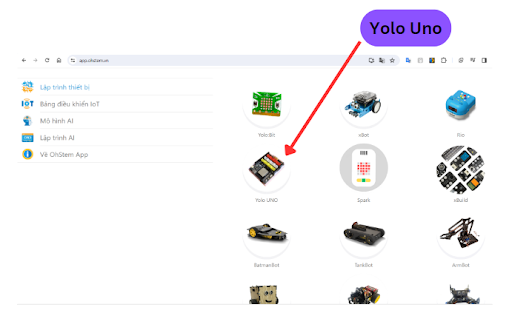
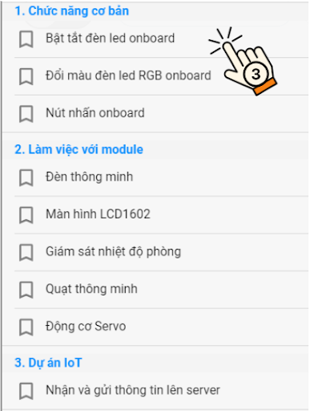
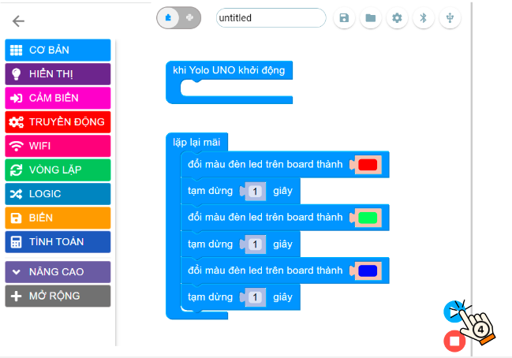

3. Các thao tác với Yolo UNO trên OhStem App
============

**1. Truy cập vào OhStem App**
------------
--------

**Bước 1:** Truy cập vào link `app.ohstem.vn <https://app.ohstem.vn/>`_ :

..  image:: images/co_ban_1.png
    :scale: 100%
    :align: center 
|

**Bước 2:** Chọn thiết bị lập trình là **Yolo UNO**

|

**Bước 3:** Chọn vào **Lập trình**:

..  image:: images/co_ban_3.png
    :scale: 100%
    :align: center 
|

**Bước 4:** 
    - Kết nối Yolo UNO vào máy tính và phần mềm lập trình
    - Kết nối dây USB type C với Máy tính và Yolo UNO.

..  image:: images/co_ban_4.png
    :scale: 100%
    :align: center 
|
    
    - Chọn icon kết nối có dây/ Bluetooth → chọn cổng COM/ thiết bị có tên gần giống là **Espressif CDC Device (COMxx)** → nhấn nút Kết nối. (*Số thứ tự của cổng COM có thể là khác nhau trên mỗi máy tính.*)

..  image:: images/co_ban_5.png
    :scale: 100%
    :align: center 
|

Khi kết nối thành công biểu tượng USB sẽ sáng đèn màu xanh:

|

**2. Xem chương trình mẫu**
------
--------

**Bước 1:** Chọn vào biểu tượng thư mục trên thanh công cụ và chọn **Project mẫu**: 

|

**Bước 2:** Chọn vào tên project để mở chương trình mẫu: 

|

**Bước 3:** Chương trình mẫu sẽ hiển thị trên màn hình, bạn chỉ cần nhấn nút chạy chương trình. (Nếu chưa kết nối thực hiện lại nội dung 1)

|

**3. Lưu chương trình vào Yolo UNO**
------
--------

Với việc chạy thử ở phần trên, chương trình chỉ mới được gửi tạm tới Yolo UNO. Nói một cách khác, chương trình này sẽ không tồn tại trên mạch Yolo UNO mỗi khi chúng ta tắt nguồn và bật lại, tương tự như bộ nhớ tạm (RAM) của máy tính thông thường.

Để chương trình luôn được lưu lại trong Yolo UNO và vận hành như một ứng dụng thực tế, bạn cần lưu nó vào mạch. Quy trình thực hiện cũng khá tương đồng với bước chạy thử, nhưng lần này, chúng ta sẽ chọn Lưu dự án vào thiết bị, như minh họa ở hình bên dưới:

    Lưu chương trình cho mạch Yolo UNO

Sau khi lưu thành công, chúng ta **cần reset lại mạch ở bước này, để khởi động lại mạch Yolo UNO**. 

Có 2 cách để chúng ta reset lại mạch:

1. Nhấn vào nút Reset (nằm gần khe cắm nguồn USB) 
2. Rút khe cắm USB và gắn lại vào mạch Yolo UNO.