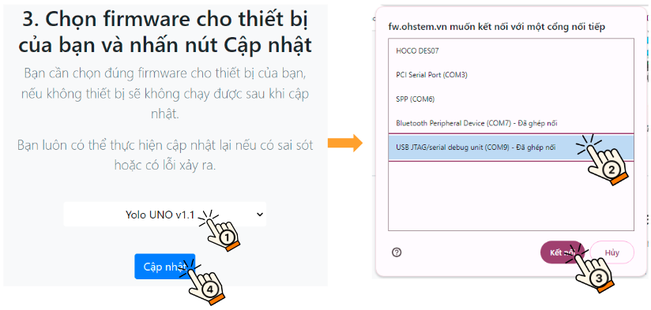
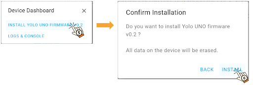

2. Hướng dẫn cập nhật firmware
===========

Phần mềm bên trong Yolo UNO (firmware) thường xuyên được cập nhật và nâng cấp, bạn nên tiến hành cập nhật khi mới sử dụng lần đầu để đảm bảo thiết bị đang chạy firmware mới nhất và sẽ giúp chạy ổn định hơn. 

Các bước thực hiện: 

- Bước 1: Truy cập vào link `<https://fw.ohstem.vn/>`_. Giao diện hiển thị như hình:

..  image:: images/fw_1.png
    :scale: 60%
    :align: center 
|

- Bước 2: Kết nối mạch Yolo UNO với laptop bằng dây USB Type C. 

..  image:: images/fw_2.png
    :scale: 80%
    :align: center 
|

- Bước 3: **Nhấn và giữ nút Boot** trên Yolo UNO, **trong lúc đó nhấn nút Reset và thả ra sau 1 giây**, **sau đó mới thả nút Boot** để thiết bị vào trạng thái sẵn sàng cập nhật firmware: 

..  image:: images/fw_3.gif
    :scale: 100%
    :align: center 
|

- Bước 4: Chọn firmware cần cập nhật là **Yolo UNO v1.x**, chọn cổng kết nối có tên là **USB/JTAG serial...** và nhấn **Cập nhật**

    Firmware sẽ được cập nhật liên tục, do đó bạn hãy chọn bản cập nhất mới nhất, ví dụ trong hình là v1.1
|

- Bước 5: Chọn **Install** để tiếp tục cập nhật firmware 

|

- Bước 6: Chờ khoảng 2 phút để cập nhật. Màn hình hiển thị cập nhật thành công như hình: 

..  image:: images/fw_6.png
    :scale: 100%
    :align: center 
|

- Bước 7: **Nhấn nút Reset** và thoát khỏi trang web cập nhật firmware và tiến hành lập trình.
