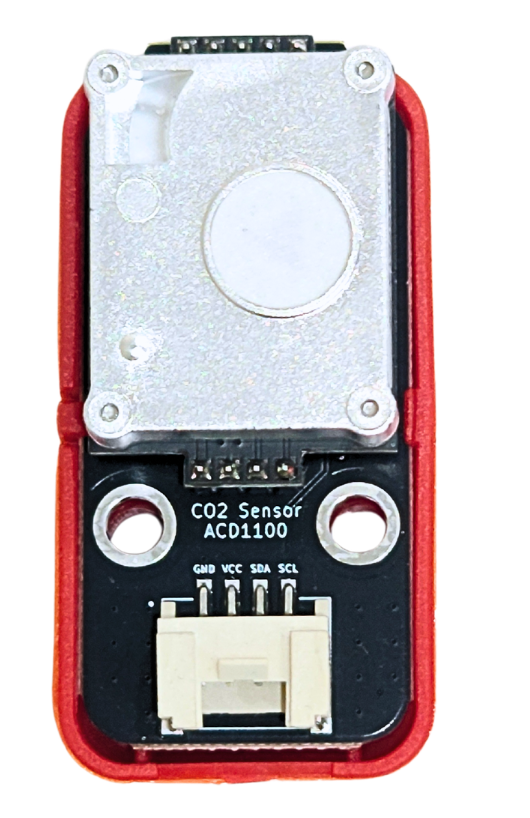
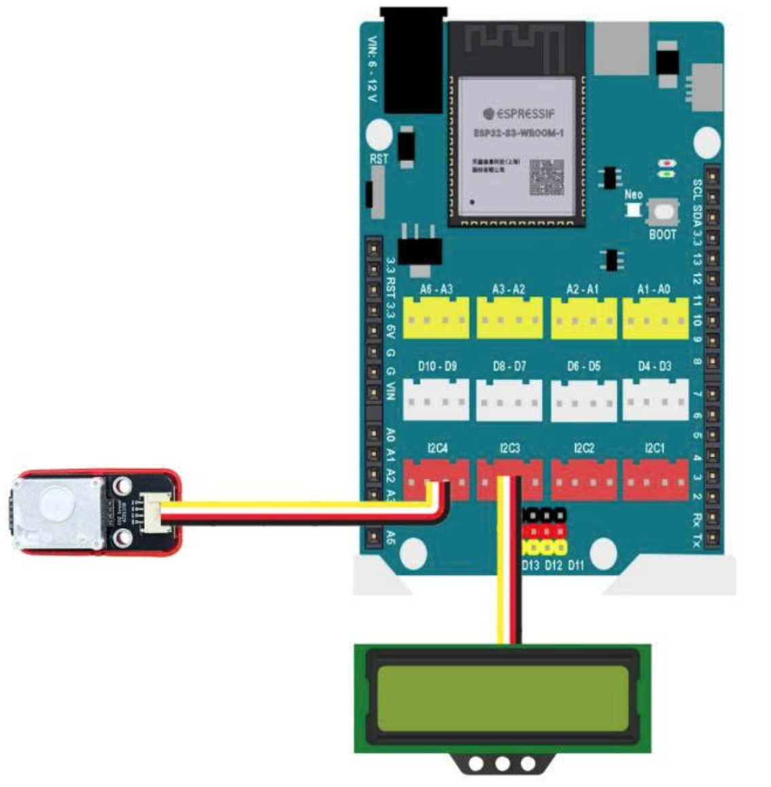
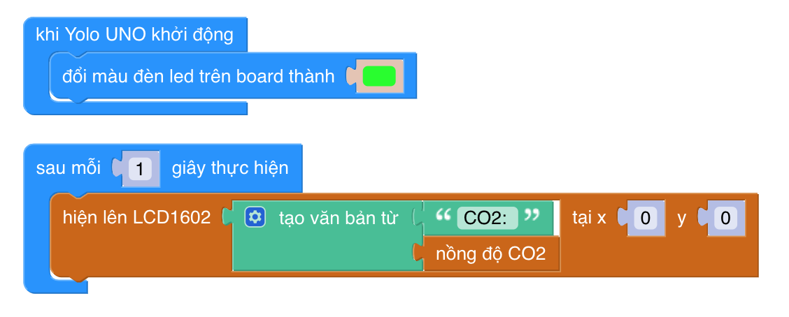

22. ACD1100 - Cảm biến CO₂ Nồng Độ Cao
==================================

Giới thiệu
----------

ACD1100 là cảm biến đo nồng độ CO₂ thế hệ mới sử dụng công nghệ **NDIR (Non-Dispersive Infrared)**,
giúp đo CO₂ chính xác và ổn định ngay cả trong môi trường nhiều bụi, ẩm hoặc thay đổi nhiệt độ.  
Module hỗ trợ giao tiếp **UART**, dễ dàng kết nối với Yolo UNO, Arduino và ESP32.

|
Cảm biến phù hợp cho các ứng dụng:

- Quan trắc chất lượng không khí trong lớp học
- Đo CO₂ trong phòng kín, nhà xưởng
- Hệ thống IoT cảnh báo ô nhiễm
- Trạm môi trường trong trường học STEM
- Nhà thông minh và nông nghiệp công nghệ cao

Đặc điểm kỹ thuật
-----------------

- Công nghệ đo: **NDIR**
- Giao tiếp: **UART** (9600 bps) hoặc **PWM**
- Điện áp hoạt động: **5V**
- Dải đo CO₂: **0 → 5000 ppm**
- Độ chính xác: ±50 ppm + 5%
- Thời gian đáp ứng: < 30 giây
- Tuổi thọ cảm biến: > 10 năm
- Bù nhiệt độ & độ ẩm tự động
- Đầu ra UART dạng khung dữ liệu tiêu chuẩn

Pinout của module
-----------------

.. csv-table::
    :header: "STT", "Chân", "Chức năng"
    :widths: 10, 15, 30

    1, "VCC", "Nguồn 5V"
    2, "GND", "Mass"
    3, "TX", "UART TX (gửi dữ liệu)"
    4, "RX", "UART RX (nhận cấu hình)"

Kết nối
-------

Kết nối cảm biến ACD1100 vào Yolo UNO / ESP32:

|

Lập trình trên OhStem App
-------------------------

Trên OhStem App, bạn chỉ cần sử dụng khối lệnh đọc CO₂ từ thư viện **Smart City** để nhận dữ liệu CO₂ từ cảm biến ACD1100.

Ví dụ chương trình:
- Nhận dữ liệu UART mỗi 1 giây
- Hiển thị CO₂ ppm lên màn hình LCD

Lưu ý sử dụng
-------------

- Không đặt cảm biến gần quạt mạnh (giảm độ chính xác)
- Tránh bụi bẩn bám trực tiếp vào màng cảm biến
- Sau khi cấp nguồn, cần **10–20 giây** để cảm biến ổn định
- Để đo lâu dài → nên hiệu chuẩn lại định kỳ 6–12 tháng
- Không dùng trong môi trường hơi hóa chất mạnh (methane/ethanol)

