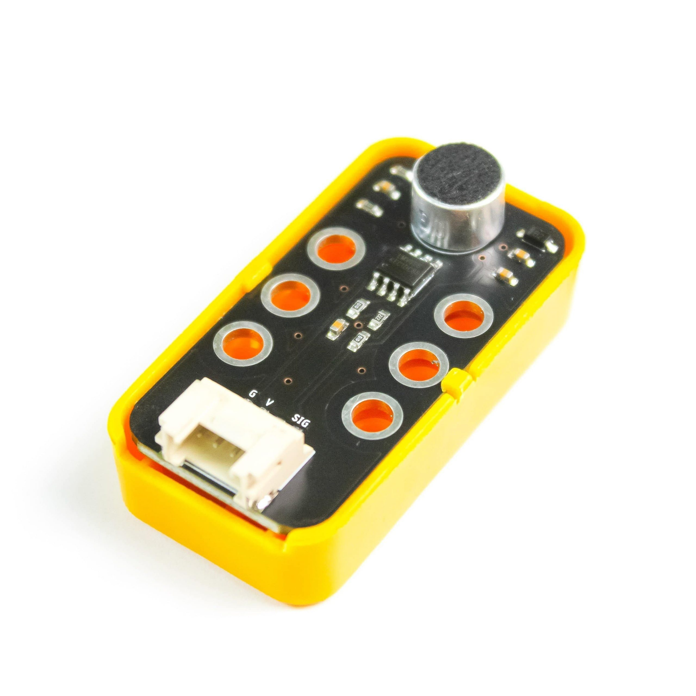
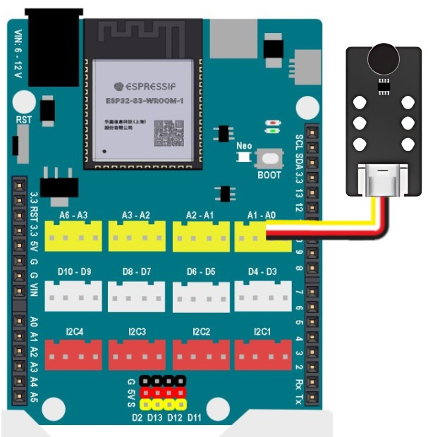

7. Cảm biến âm thanh
======

**1. Giới thiệu:** 
---------
-------------

| 

Cảm biến âm thanh là loại cảm biến dùng để phát hiện cường độ âm thanh trong môi trường xung quanh. Thành phần chính của cảm biến này là bộ khuếch đại công suất thấp LM358. Cảm biến thường được sử dụng để xây dựng một số dự án như: Công tắc điều khiển bằng giọng nói, cảnh báo tiếng ồn…

Với hướng dẫn này, chúng ta sẽ làm dự án cảnh báo tiếng ồn và hiển thị ra màn hình kết quả âm thanh đo được. 

**Thông số kỹ thuật**

    + Điện áp hoạt động: 3.3V
    + Độ nhạy microphone (1 Khz): 50-54dB
    + Nội trở microphone: 2.2 KΩ
    + Tần số của microphone : 16-20 KHz
    + Dạng tín hiệu: ngõ ra analog
    + Dòng điện tối đa: 0.5mA
    + IC khuếch đại công suất: LM358

**2. Chuẩn bị các thiết bị:**
-----------
------------

.. list-table:: 
   :widths: auto
   :header-rows: 1
     
   * - .. image:: images/yolo_uno.png
          :width: 200px
          :align: center
     - .. image:: images/am_thanh.1.jpg
          :width: 200px
          :align: center
   * - Máy tính lập trình Yolo UNO
     - Cảm biến âm thanh
   * - `Mua sản phẩm <https://shop.ohstem.vn/san-pham/yolo-uno/>`_
     - `Mua sản phẩm <https://shop.ohstem.vn/san-pham/cam-bien-am-thanh/>`_

**3. Kết nối phần cứng**
-----------
------------

Kết nối cảm biến âm thanh vào **cổng Analog: A0 - A1** (có thể kết nối các cổng Analog khác từ A0 - A6)

|

**4. Hướng dẫn lập trình:**
--------
------------

- **Giới thiệu khối lệnh:**

    + Câu lệnh dùng để đọc kết quả đo tiếng ồn

    .. image:: images/am_thanh.3.jpg
        :scale: 50%
        :align: center 
|

    + Câu lệnh in kết quả ra cửa sổ Serial

    .. image:: images/am_thanh.4.jpg
        :scale: 70%
        :align: center 
|

- **Viết chương trình:**

    ..  figure:: images/am_thanh.5.jpg
        :scale: 60%
        :align: center

        `<https://app.ohstem.vn/#!/share/yolouno/2kuBRft3hvQQIaNm2fBIueH4jQr>`_ 

    Sau khi hoàn thiện chương trình, thực hiện thao tác bật cửa sổ Serial như sau: 

    ..  figure:: images/am_thanh.6.jpg
        :scale: 50%
        :align: center

Kết nối và gửi chương trình xuống Yolo UNO, kết quả chương trình sẽ được in ra cửa sổ serial sau mỗi giây. Đồng thời, nếu kết quả đo được trên mức 20 thì đèn LED trên board bật đèn đỏ. Ngược lại, tắt đèn. 

