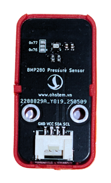
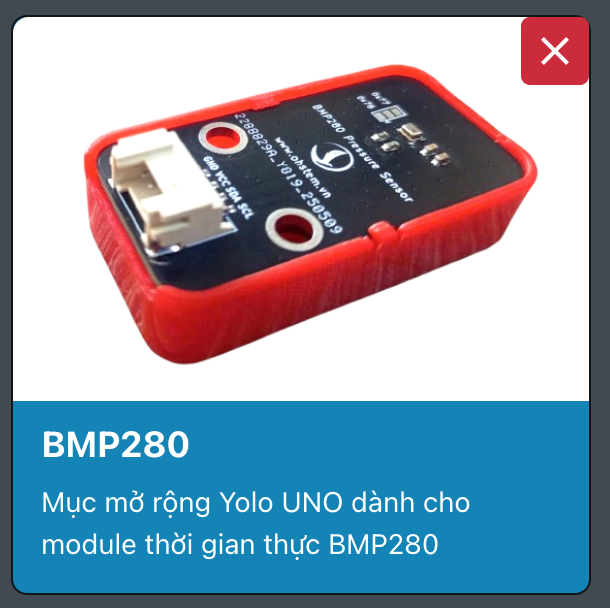
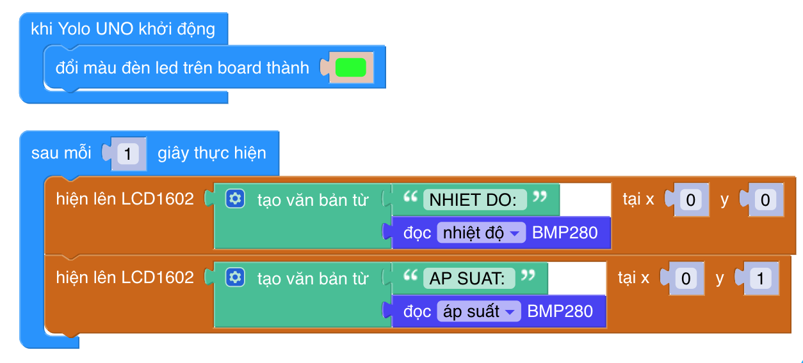

17. Module cảm biến môi trường BMP280
======================================

| 

Module BMP280 là cảm biến môi trường tích hợp có khả năng đo **nhiệt độ** và **áp suất không khí** chính xác cao. Nhờ kích thước nhỏ gọn, giao tiếp I2C dễ dùng và mức tiêu thụ điện thấp, BMP280 rất phù hợp cho các dự án thời tiết, đo độ cao, hoặc giám sát môi trường.

BMP280 giao tiếp qua chuẩn **I2C**, chỉ cần 2 dây tín hiệu (SDA và SCL), giúp dễ dàng tích hợp vào các mạch điều khiển như **Yolo UNO của OhStem**.

Đặc điểm nổi bật của BMP280:

+ Đo nhiệt độ và áp suất không khí chính xác
+ Giao tiếp I2C đơn giản, dễ kết nối
+ Kích thước nhỏ, dễ lắp đặt
+ Dải điện áp hoạt động rộng (3.3V)
+ Có thể tính toán độ cao từ áp suất

**1. Thông số kỹ thuật**
------------------------

- **Thông số kỹ thuật**

  + Điện áp hoạt động: 3.3V
  + Giao tiếp: I2C
  + Địa chỉ I2C: 0x76 hoặc 0x77 (tuỳ phiên bản)
  + Đo áp suất: 300 - 1100 hPa
  + Đo nhiệt độ: -40 – 85 ℃
  + Sai số nhiệt độ: ±1.0°C
  + Sai số áp suất: ±1 hPa
  + Tiêu thụ điện năng: rất thấp

- **Pinout của module**

Module BMP280 có 4 chân, với chức năng như sau:

.. csv-table:: 
    :header: "STT", "Chân", "Chức năng"
    :widths: 10, 15, 30

    1, "GND", "Nối đất"
    2, "VCC", "Cấp nguồn (3.3V)"
    3, "SCL", "Chân xung nhịp I2C"
    4, "SDA", "Chân dữ liệu I2C"

**2. Kết nối**
--------------

- **Bước 1**: Chuẩn bị các thiết bị như sau:

.. list-table:: 
   :widths: auto
   :header-rows: 1
     
   * - .. image:: images/yolouno.png
          :width: 200px
          :align: center
     - .. image:: images/bmp280_01.png
          :width: 200px
          :align: center
   * - Máy tính lập trình Yolo UNO
     - Module BMP280
   * - `Mua sản phẩm <https://ohstem.vn/product/may-tinh-lap-trinh-yolobit/>`_
     - `Mua sản phẩm <https://ohstem.vn/product/module-bmp280/>`_

- **Bước 2**: Kết nối module BMP280 vào cổng I2C bất kỳ của mạch mở rộng:

.. figure:: images/bmp280_02.png
    :scale: 100%
    :align: center

    Module BMP280 kết nối qua I2C nên có thể cắm vào bất kỳ cổng I2C nào.

**3. Lập trình BMP280 với Yolo UNO trên OhStem App**
-----------------------------------------------------

Để lập trình module BMP280, bạn cần tải thư viện mở rộng từ liên kết sau:

`https://github.com/AITT-VN/yolouno_extension_bmp280.git`

    Xem hướng dẫn thêm thư viện mở rộng `tại đây <https://docs.ohstem.vn/en/latest/module/thu-vien-yolobit.html>`_

|

**Chương trình cơ bản để đọc nhiệt độ và áp suất:**

    Chương trình đơn giản đọc nhiệt độ và áp suất mỗi 1 giây.

**Giá trị đọc được:**

- Nhiệt độ môi trường (°C)
- Áp suất khí quyển (hPa)
- Có thể tính toán độ cao tương đối (nếu cần)

**Lưu ý**

+ Địa chỉ I2C có thể là `0x76` hoặc `0x77` – nếu module không hoạt động, hãy kiểm tra lại địa chỉ trong thư viện.
+ Có thể kết hợp với màn hình OLED hoặc hiển thị lên Serial để theo dõi dữ liệu thực tế.

**Chương trình mẫu** `tại đây <https://app.ohstem.vn/#!/share/yolouno/1eabcXYZsensorDemo>`_
