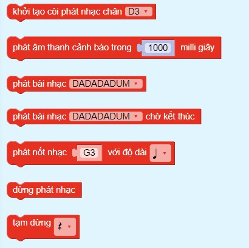
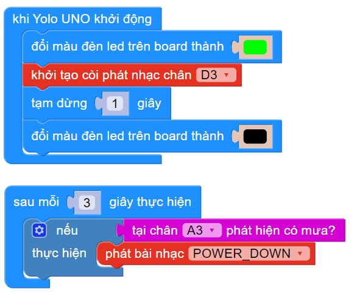

14. Còi báo
=========

**1. Giới thiệu:** 
---------
-------------

| 

Module còi báo được sử dụng để tạo ra âm thanh khi kích tín hiệu (PWM), thường được dùng trong các dự án làm thiết bị chống trộm, hệ thống báo hiệu… 

Với hướng dẫn này, sẽ thực hiện chương trình làm hệ thống cảnh báo nước mưa. 

**Thông số kỹ thuật:**

    + Đầu vào: Digital
    + Điện áp 3.3 ~ 5V, tần số âm thanh khoảng: 2,5 KHz

**2. Chuẩn bị các thiết bị:**
-----------
------------

.. list-table:: 
   :widths: auto
   :header-rows: 1
     
   * - .. image:: images/yolo_uno.png
          :width: 200px
          :align: center
     - .. image:: images/coi_bao.1.jpg
          :width: 200px
          :align: center
     - .. image:: images/nuoc_1.jpg
          :width: 200px
          :align: center
   * - Máy tính lập trình Yolo UNO
     - Còi báo
     - Cảm biến nước
   * - `Mua sản phẩm <https://ohstem.vn/product/yolo-uno/>`_
     - `Mua sản phẩm <https://ohstem.vn/product/module-coi-bao/>`_
     - `Mua sản phẩm <https://ohstem.vn/product/cam-bien-nuoc/>`_

**3. Kết nối phần cứng**
-----------
------------

- Kết nối cảm biến nước vào cổng Analog: A3 - A6
- Kết nối còi báo vào cổng Digital: D3 - D4

|

**4. Hướng dẫn lập trình:**
--------
------------

- **Tải thư viện Buzzer**, xem hướng dẫn tải thư viện `tại đây <https://docs.ohstem.vn/en/latest/module/thu-vien-yolouno.html>`_  

|

Các khối lệnh sau để làm việc với cảm biến:

|

- **Viết chương trình**: 

    `<https://app.ohstem.vn/#!/share/yolouno/2kx9x9rIjdzEZRV8T6F6dyvL5vD>`_

.. note::

    **Giải thích chương trình:** 

    Sau mỗi 3 giây, chương trình sẽ kiểm tra kết quả nhận được từ cảm biến, nếu phát hiện có nước trên bề mặt cảm biến nước thì còi sẽ phát âm báo.