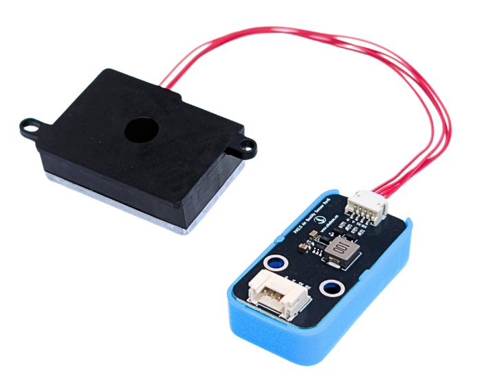
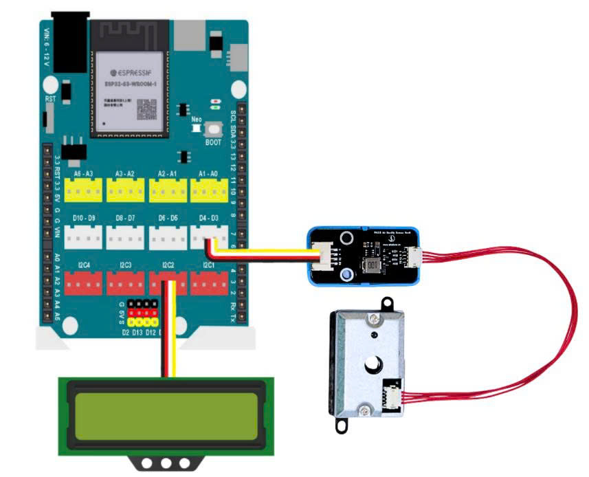
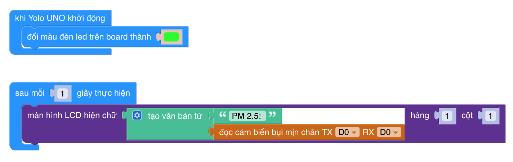

23. DC01 - Module cảm biến bụi PM2.5 hồng ngoại (UART)
===========================================

Giới thiệu
----------

DC01 là cảm biến đo nồng độ bụi mịn **PM2.5** sử dụng nguyên lý **tán xạ ánh sáng hồng ngoại (Infrared Scattering)**.
Cảm biến cho phép đo chính xác mật độ bụi trong không khí và xuất dữ liệu **dạng số qua UART**, rất phù hợp
cho các hệ thống quan trắc chất lượng không khí trong lớp học, nhà ở và dự án STEM – IoT.

DC01 thường được dùng để:

- Đo nồng độ bụi PM2.5 trong không khí
- Cảnh báo ô nhiễm không khí trong lớp học
- Trạm đo môi trường mini
- Nhà thông minh, hệ thống lọc không khí
- Dự án STEM về môi trường & sức khỏe

Đặc điểm kỹ thuật
-----------------

- Phương pháp đo: **Tán xạ hồng ngoại**
- Loại bụi đo được: **PM2.5**
- Giao tiếp: **UART (TTL)**
- Điện áp hoạt động: **5V**
- Tốc độ UART: **9600 bps**
- Dải đo PM2.5: **0 – 1000 µg/m³**
- Độ chính xác cao, ổn định lâu dài
- Thời gian đáp ứng nhanh

Pinout của module
-----------------

.. csv-table::
    :header: "STT", "Chân", "Chức năng"
    :widths: 10, 15, 30

    1, "VCC", "Nguồn 5V"
    2, "GND", "Mass"
    3, "TX", "UART TX (gửi dữ liệu)"
    4, "RX", "UART RX (nhận lệnh – tùy chọn)"

Kết nối với Yolo UNO / ESP32
----------------------------

Kết nối DC01 với Yolo UNO hoặc ESP32 như sau:

|

Nguyên lý hoạt động
-------------------

Cảm biến sử dụng tia hồng ngoại chiếu vào luồng không khí:

- Hạt bụi đi qua → làm tán xạ ánh sáng
- Cường độ ánh sáng tán xạ tỷ lệ với mật độ bụi
- Vi xử lý bên trong chuyển đổi thành dữ liệu PM2.5 (µg/m³)
- Gửi dữ liệu ra ngoài qua UART

Lập trình trên OhStem App
-------------------------

Sử dung OhStem App, bạn có thể lập trình để đọc dữ liệu PM2.5 từ cảm biến DC01 như sau:
Dùng khối lệnh trong thư viện **Smart City**:

|
Chương trình mẫu:
- Đọc dữ liệu PM2.5 từ DC01 mỗi 1 giây
- Hiển thị giá trị lên màn hình LCD
Lưu ý khi sử dụng
-----------------

- Không che lỗ hút gió của cảm biến
- Không đặt sát quạt mạnh hoặc cửa sổ gió lớn
- Sau khi cấp nguồn, chờ **10–15 giây** để ổn định
- Nên vệ sinh lưới lọc định kỳ để đảm bảo độ chính xác
- Phù hợp sử dụng trong nhà và môi trường học đường

