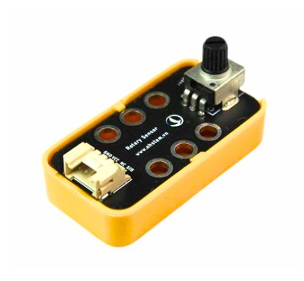
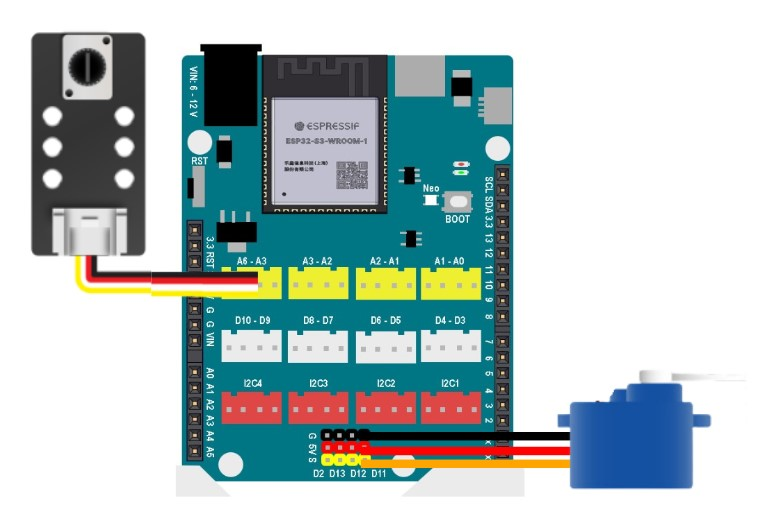

13. Cảm biến góc xoay
========

**1. Giới thiệu:** 
---------
-------------

| 

Cảm biến góc xoay là một điện trở có 3 chân tín hiệu. Điện trở của nó có thể điều chỉnh bằng cách xoay núm xoay. 

Phạm vị điều chỉnh của module có điện trở cao nhất là 10KΩ. Bạn có thể sử dụng cảm biến góc xoay để điều chỉnh tốc độ quay của động cơ, độ sáng của đèn LED. 

Với hướng dẫn này, sẽ thực hiện chương trình điều chỉnh góc xoay của servo theo góc xoay của cảm biến.

**Thông số kỹ thuật**

    + Điện áp hoạt động: 3.3V
    + Dòng điện tối đa: 30 mA
    + Công suất: 0.1 W
    + Góc xoay: 280°
    + Tổng trở resistance: 10 KΩ
    + Kiểu tính hiệu: tín hiệu analog (0~4095)

**2. Chuẩn bị các thiết bị:**
-----------
------------

.. list-table:: 
   :widths: auto
   :header-rows: 1
     
   * - .. image:: images/yolo_uno.png
          :width: 200px
          :align: center
     - .. image:: images/goc_xoay.1.jpg
          :width: 200px
          :align: center
     - .. image:: images/servo.png
          :width: 200px
          :align: center
   * - Máy tính lập trình Yolo UNO
     - Cảm biến góc xoay
     - Servo 180 độ
   * - `Mua sản phẩm <https://ohstem.vn/product/yolo-uno/>`_
     - `Mua sản phẩm <https://ohstem.vn/product/cam-bien-goc-xoay/>`_
     - `Mua sản phẩm <https://ohstem.vn/product/dong-co-servo-sg90s/>`_

**3. Kết nối phần cứng**
-----------
------------

- Kết nối cảm biến góc xoay vào cổng Analog: A3 - A6
- Kết nối servo vào chân D11

|

**4. Hướng dẫn lập trình:**
--------
------------

    ..  figure:: images/goc_xoay.3.jpg
        :scale: 70%
        :align: center

        `<https://app.ohstem.vn/#!/share/yolouno/2kxBUWoMAdU1LkMLXUU3HdOqk85>`_ 

.. note::

    **Giải thích chương trình:** 

    Sau mỗi giây, Yolo UNO sẽ đọc giá trị của cảm biến góc xoay và chuyển đổi từ giá trị analog 0 - 4095 thành 0 - 180 độ. Khi núm xoay của cảm biến được vặn, góc của servo sẽ thay đổi.  

Trong chương trình có sử dụng biến vị trí góc, cách tạo biến như sau: 

**Hướng dẫn tạo biến:**

1. Bạn cần vào mục Biến và chọn Tạo biến. Sau đó, điền tên cho biến mới để Tạo.

    ..  figure:: images/goc_xoay.4.png
        :scale: 70%
        :align: center

2. Khi tạo biến thành công, trong mục Biến sẽ xuất hiện những khối lệnh liên quan để làm việc với biến.

    ..  figure:: images/goc_xoay.5.png
        :scale: 70%
        :align: center