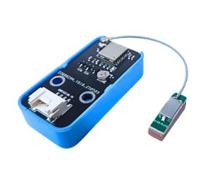

15. Mạch định vị GPS BDS ATGM336H
========

| 

Mạch định vị GPS BDS ATGM336H có thiết kế nhỏ gọn sử dụng IC chính SoC GNSS AT6558 thế hệ thứ 4 với khả năng tiết kiệm năng lượng vượt trội, mạch bắt tín hiệu định vị và thời gian nên các hệ thống GPS/US, Beidou/CN, GLONASS/RU, Galileo/EU, QZSS/JP, SBAS/enhanced system qua 32 kênh tracking chanel.
Mạch định vị GPS BDS ATGM336H có chuẩn đầu ra tín hiệu của mạch tương thích với các module của Ublox (NEO-6M / NEO-7/ NEO-M8N) nên có thể thay thế dễ dàng, sử dụng chung code mẫu Arduino và phần mềm U-Center trên máy tính, phù hợp với các ứng dụng định vị vị trí và lấy thời gian qua GPS.

**1. Thông số kỹ thuật**
---------
------------

- **Thông số kỹ thuật**

    + Điện áp cấp: 3.3~ 5VDC
    + IC chính: SoC GNSS AT6558
    + Giao tiếp UART/TTL.
    + Baudrate: 9600 (Default), 1200, 2400, 4800, 19200, 38400, 57600, 115200, 230400, 460800, 921600.
    + Tracking channels: 32
    + GNSS engine for GPS/US, Beidou/CN, GLONASS/RU, Galileo/EU, QZSS/JP, SBAS/enhanced system.
    + Support A-GNSS
    + Cold start capture sensitivity: -148dBm
    + Tracking sensitivity: -162dBm
    + Positioning accuracy: 2.5 meters (CEP50, open area)
    + First positioning time: 32 seconds
    + Low power consumption: continuous operation <25mA (@ 3.3V)
    + Kích thước: 15.7 x 13.1 mm

- **Pinout của module**

Module GPS có 4 chân, và mỗi chân có chức năng như sau:

..  csv-table:: 
    :header: "STT", "Chân", "Chức năng"
    :widths: 10, 15, 30

    1, "GND", "Nối đất"
    2, "VCC", "Cấp nguồn (3.3V)"
    3, "RX", "Đầu nhận tín hiệu"
    4, "TX", "Đầu gửi tín hiệu"

**2. Kết nối**
------------
------------

- **Bước 1**: Chuẩn bị các thiết bị như sau: 

.. list-table:: 
   :widths: auto
   :header-rows: 1
     
   * - .. image:: images/yolo_uno01.png
          :width: 200px
          :align: center
     - .. image:: images/gps01.png
          :width: 200px
          :align: center
   * - Máy tính lập trình Yolo UNO
     - Module GPS
   * - `Mua sản phẩm <https://ohstem.vn/product/yolo-uno/>`_
     - `Mua sản phẩm <https://ohstem.vn/product/module-gps//>`_

- **Bước 2**: Kết nối dây tín hiệu với module vào Yolo UNO như hình: 

    Module GPS sẽ kết nối với mạch Yolo UNO ở cổng D3-D4 theo mẫu. Dây màu đỏ tương ứng với dây nguồn dương (VCC), dây màu đen tương ứng nguồn âm (GND). Dây tín hiệu Tx và Rx sẽ quy định trong phần lập trình.

**3. Lập trình module GPS với Yolo UNO trên OhStem App**
--------
------------

Để lập trình module GPS, chúng ta phải cần thêm thư viện mở rộng GPS, bạn vào mục mở rộng để tải thư viện mở rộng **GPS**.

    Xem hướng dẫn tải thư viện `tại đây <https://docs.ohstem.vn/en/latest/module/thu-vien-yolobit.html>`_.

| 

**Chương trình cơ bản để lấy tín hiệu từ GPS:**

Đầu tiên chúng ta sẽ khởi tạo module GPS từ chân D3 và D4

Sau khi khởi tạo, chúng ta sẽ kiểm tra thông tin GPS bằng khối lệnh : 

Các thông tin chúng ta được GPS hỗ trợ sẽ bao gồm các thông tin như sau : 

Chương trình đơn giản để kiểm tra thời gian, tọa độ lấy được từ GPS định kì mỗi 1 giây sẽ như sau:

 
**Lưu ý**
 + Module cần một khoảng thời gian để "cold start" (tìm vệ tinh lần đầu) – nên thử ngoài trời để tín hiệu mạnh.
 + Hạn chế đặt gần thiết bị nhiễu sóng cao (WiFi mạnh, mô-tơ điện).

**Chương trình tham khảo** `tại đây <https://app.ohstem.vn/#!/share/yolouno/2yfPRJ6NBwiBUm0MxYlKc87XB95>`_.