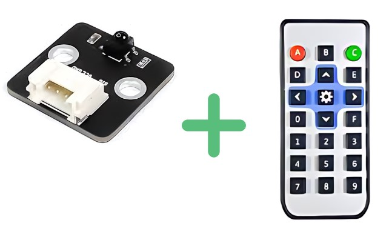
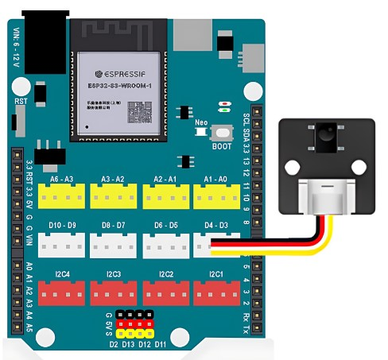

10. Mắt đọc IR và Remote
============

**1. Giới thiệu:** 
---------
-------------

| 

Module mắt đọc hồng ngoại IR được dùng để trao đổi tín hiệu giữa các thiết bị với nhau, dựa trên công nghệ tia hồng ngoại (tia sáng có bước sóng dài, nằm trong khoảng từ 700nm và có tần số 430 TGHz, mắt người không thể nhìn thấy được).

Với hướng dẫn này, sẽ viết chương trình điều khiển tín hiệu đèn của đèn trên board bằng cách nhấn nút trên Remote. 

**Thông số kỹ thuật**

    + Điện áp sử dụng: 3.3V
    + Tần số nhận: 38kHz
    + Khoảng cách: 10m (MAX)
    + Tín hiệu: Digital

**2. Chuẩn bị các thiết bị:**
-----------
------------

.. list-table:: 
   :widths: auto
   :header-rows: 1
     
   * - .. image:: images/yolo_uno.png
          :width: 200px
          :align: center
     - .. image:: images/ir.1.jpg
          :width: 200px
          :align: center
   * - Máy tính lập trình Yolo UNO
     - Mắt đọc IR và remote
   * - `Mua sản phẩm <https://ohstem.vn/product/yolo-uno/>`_
     - `Mua sản phẩm <https://ohstem.vn/product/mat-doc-hong-ngoai-ir/>`_

**3. Kết nối phần cứng**
-----------
------------

- Kết nối mắt đọc IR vào cổng D3 - D4

|

**4. Hướng dẫn lập trình:**
--------
------------

- **Tải thư viện IR Remote**, như hình (Xem hướng dẫn tải thư viện `tại đây <https://docs.ohstem.vn/en/latest/module/thu-vien-yolouno.html>`_):

    .. image:: images/ir.3.png
        :scale: 90%
        :align: center 
|
    Các khối lệnh mới xuất hiện như hình: 

    .. image:: images/ir.4.png
        :scale: 80%
        :align: center 

- **Viết chương trình:**

    ..  figure:: images/ir.5.jpg
        :scale: 80%
        :align: center

        `<https://app.ohstem.vn/#!/share/yolouno/2kwz9D9ikRC6vBOnilz8A1YqAIe>`_ 

.. note::

    **Giải thích chương trình:** 

    Khi bắt đầu chương trình, cần khởi tạo mắt đọc IR (cảm biến hồng ngoại) và thực hiện việc kiểm tra tín hiệu nhận được từ remote. Nếu nút A trên remote được nhấn, đèn trên board sẽ đổi sang màu đỏ, tương tự cho nút B và C. Hãy quan sát tín hiệu đèn khi nhấn remote. 