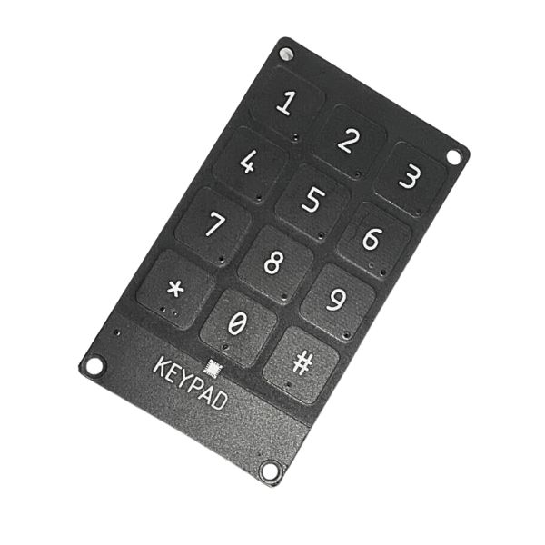
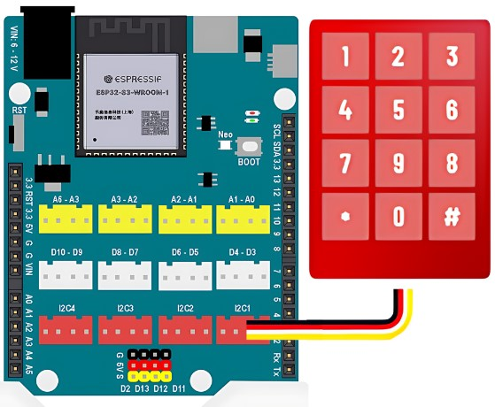

9. Keypad - Bàn phím cảm ứng điện dung
===========

**1. Giới thiệu:** 
---------
-------------

| 

Bàn phím cảm ứng điện sử dụng IC chuyên dụng MPR121 có khả năng nhận biết điện dung từ tay người qua 12 vị trí cảm ứng với độ chính xác và độ nhạy cao, bàn phím phù hợp với các ứng dụng cần độ bền, tạo sự độc đáo và chuyên nghiệp trong các ứng dụng điều khiển cảm ứng, bàn phím sử dụng giao tiếp I2C rất dễ kết nối và giao tiếp chỉ với 2 chân GPIO.

Với hướng dẫn này, sẽ thực hiện chương trình nhập mật khẩu từ bàn phím, khi nhập đúng, đèn trên board sẽ sáng đèn đỏ. 

**Thông số kỹ thuật**

    + IC chính: MPR121
    + Điện áp sử dụng: 3.3VDC
    + Giao tiếp: I2C
    + Mức logic giao tiếp: TTL 3.3V

**2. Chuẩn bị các thiết bị:**
-----------
------------

.. list-table:: 
   :widths: auto
   :header-rows: 1
     
   * - .. image:: images/yolo_uno.png
          :width: 200px
          :align: center
     - .. image:: images/keypad.1.jpg
          :width: 200px
          :align: center
   * - Máy tính lập trình Yolo UNO
     - Keypad
   * - `Mua sản phẩm <https://shop.ohstem.vn/san-pham/yolo-uno/>`_
     - `Mua sản phẩm <https://shop.ohstem.vn/san-pham/keypad-ban-phim-cam-ung-dien-dung/>`_

**3. Kết nối phần cứng**
-----------
------------

Kết nối cảm biến âm thanh vào **cổng Analog: A0 - A1** (có thể kết nối các cổng Analog khác từ A0 - A6)

|

**4. Hướng dẫn lập trình:**
--------
------------

- **Tải thư viện Keypad MPR121**, như hình (Xem hướng dẫn tải thư viện `tại đây <https://docs.ohstem.vn/en/latest/module/thu-vien-yolouno.html>`_):

    .. image:: images/keypad.3.png
        :scale: 70%
        :align: center 

    Các khối lệnh mới xuất hiện như hình: 

    .. image:: images/keypad.4.png
        :scale: 80%
        :align: center 

- **Viết chương trình:**

    ..  figure:: images/keypad.5.jpg
        :scale: 60%
        :align: center

        `<https://app.ohstem.vn/#!/share/yolouno/2kuXeiRgZQYLZZsR7IkqyIAnHhC>`_ 

.. note::

    **Giải thích chương trình:** 

    Sau khi gửi chương trình xuống thiết bị. Sau mỗi 3 giây, chương trình sẽ kiểm tra kết quả nhập được từ keypad. Nếu nhập đúng ký tự “1234#” từ keypad, đèn trên board sẽ đổi màu trắng, ngược lại, đèn sẽ tắt.  
