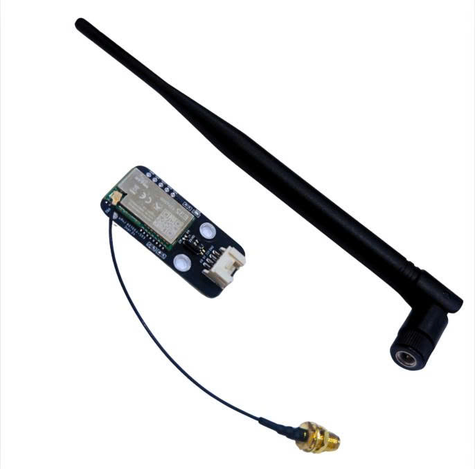
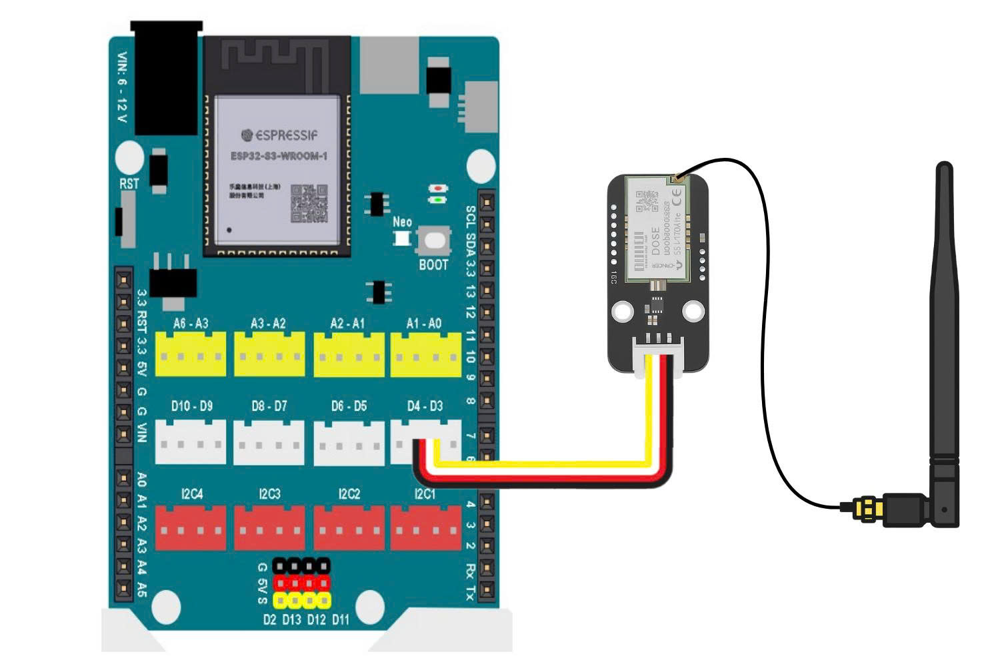
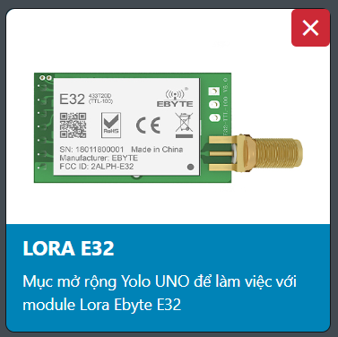
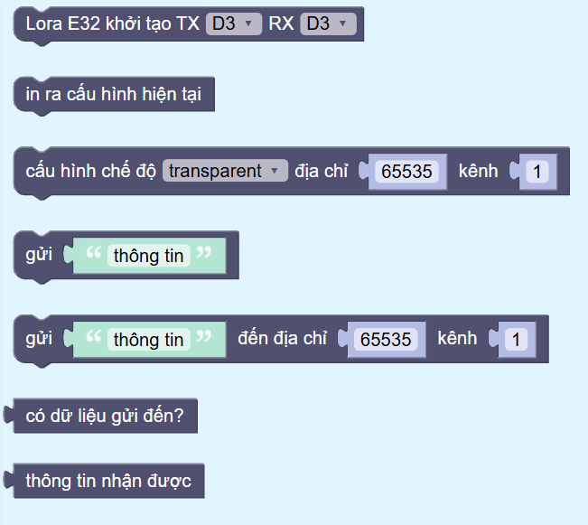
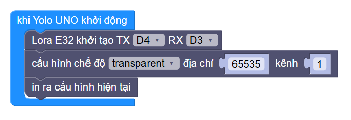
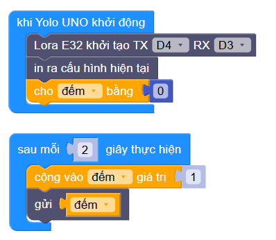
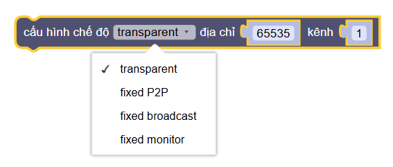

19. Module truyền nhận không dây LoRa E32 (SX1278)
===================================================

| 

Module **LoRa E32** là mạch thu phát dữ liệu không dây tầm xa, sử dụng công nghệ **LoRa (Long Range Radio)** với chip **SX1278** của hãng **SEMTECH**.  
Điểm nổi bật của LoRa là **khoảng cách truyền cực xa** và **mức tiêu thụ năng lượng thấp**, rất phù hợp cho các ứng dụng IoT.

Module E32 được tích hợp sẵn bộ chuyển đổi từ **SPI sang UART**, giúp việc giao tiếp trở nên đơn giản hơn — chỉ cần giao tiếp qua 2 chân **TX, RX** là có thể truyền nhận dữ liệu.

Với mạch **Yolo UNO** hoặc **Yolo:Bit**, bạn có thể sử dụng LoRa E32 để truyền dữ liệu giữa hai hoặc nhiều thiết bị ở khoảng cách lên đến **3km** (trong điều kiện lý tưởng).

---

**1. Thông số kỹ thuật**
------------------------

- **Model:** EBYTE E32-433T20DC (LoRa SX1278 433MHz)
- **IC chính:** SX1278 (SEMTECH)
- **Điện áp hoạt động:** 2.3 – 5.5VDC
- **Điện áp giao tiếp:** TTL 3.3V
- **Giao tiếp:** UART (8N1), tốc độ baud 1200 – 115200 bps
- **Tần số hoạt động:** 410 – 441 MHz
- **Công suất phát:** 20dBm (100mW)
- **Khoảng cách truyền:** tối đa 3000m (điều kiện lý tưởng)
- **Tốc độ truyền dữ liệu:** 0.3 – 19.2 Kbps (mặc định 2.4 Kbps)
- **Bộ đệm:** 512 bytes
- **Địa chỉ hỗ trợ:** 65536 địa chỉ
- **Kích thước:** 21mm x 36mm

---

**2. Chế độ hoạt động**
-----------------------

Module LoRa E32 có hai chân điều khiển **M0** và **M1**, được dùng để thay đổi **chế độ làm việc**.  
Cấu hình logic hai chân này như sau:

.. csv-table::
    :header: "M1", "M0", "Chế độ", "Mô tả"
    :widths: 10, 10, 30, 60

    0, 0, "Normal", "Truyền và nhận dữ liệu bình thường qua UART."
    0, 1, "Wake-up", "Giống như Normal mode, thêm mã 'preamble' để đánh thức thiết bị đang sleep."
    1, 0, "Power Saving", "Tiết kiệm năng lượng – chỉ nhận dữ liệu định kỳ, không liên tục."
    1, 1, "Sleep/Configuration", "Dùng để cấu hình thông số như địa chỉ, kênh, tốc độ truyền, v.v."

---

**3. Các chế độ truyền**
------------------------

Module hỗ trợ hai nhóm chính: **Transparent** và **Fixed Addressing**, mỗi nhóm gồm 3 chế độ truyền khác nhau.

.. csv-table::
    :header: "Loại truyền", "Mô tả", "Thiết bị gửi", "Thiết bị nhận"
    :widths: 25, 40, 20, 20

    "Transparent point-to-point", "Truyền dữ liệu trực tiếp giữa 2 thiết bị có cùng địa chỉ & kênh.", "Dữ liệu gốc", "Dữ liệu gốc"
    "Transparent broadcast", "Truyền dữ liệu từ 1 thiết bị đến nhiều thiết bị (cùng địa chỉ & kênh).", "Dữ liệu gốc", "Dữ liệu gốc"
    "Transparent monitor", "Thiết bị A (địa chỉ 0xFFFF) giám sát dữ liệu giữa các thiết bị khác cùng kênh.", "Dữ liệu gốc", "Dữ liệu gốc"
    "Fixed point-to-point", "Truyền dữ liệu có địa chỉ đích và kênh cụ thể (các thiết bị khác địa chỉ vẫn nhận được).", "Địa chỉ + kênh + dữ liệu", "Dữ liệu"
    "Fixed broadcast", "Truyền dữ liệu từ A đến nhiều thiết bị có chung kênh.", "0xFFFF + kênh + dữ liệu", "Dữ liệu"
    "Fixed monitor", "Giám sát truyền tải dữ liệu giữa các thiết bị trong cùng kênh (địa chỉ 0xFFFF).", "Địa chỉ + kênh + dữ liệu", "Dữ liệu"

---

**4. Kết nối phần cứng**
------------------------

- **Bước 1**: Chuẩn bị các thiết bị như sau:

.. list-table::
   :widths: auto
   :header-rows: 1
     
   * - .. image:: images/yolo_uno.png
          :width: 200px
          :align: center
     - .. image:: images/lorae32_01.png
          :width: 200px
          :align: center
   * - Yolo UNO
     - Module LoRa E32
   * - `Mua sản phẩm <https://shop.ohstem.vn/san-pham/yolo-uno/>`_
     - `Mua sản phẩm <https://shop.ohstem.vn/san-pham/lora-e32/>`_

- **Bước 2**: Kết nối module LoRa E32 vào cổng **UART** của mạch mở rộng, ví dụ này sẽ nối vào chân D3-D4:

  + TX của E32 → RX của Yolo UNO  
  + RX của E32 → TX của Yolo UNO
  + VCC → 3.3V  
  + GND → GND

    Sơ đồ kết nối module LoRa E32 với mạch Yolo UNO qua UART.

---

**5. Lập trình LoRa E32 với Yolo UNO trên OhStem App**
-------------------------------------------------------

Để lập trình, bạn cần cài đặt thư viện mở rộng LoRa E32:

`https://github.com/AITT-VN/yolouno_extension_lorae32`

    Xem hướng dẫn thêm thư viện mở rộng `tại đây <https://docs.ohstem.vn/en/latest/module/thu-vien-yolobit.html>`_

|

Sau khi tải xong, khối lệnh **LoRa E32** sẽ xuất hiện trong danh mục khối mở rộng.  
Các khối chính bao gồm:

|

- **Khởi tạo LoRa E32** (chọn chân TX, RX, M0, M1)  
- **Cấu hình chế độ truyền** (Transparent / Fixed)  
- **Thiết lập địa chỉ và kênh truyền**  
- **Gửi và nhận dữ liệu LoRa**

---

**Ví dụ: Truyền dữ liệu Transparent point-to-point**
-----------------------------------------------------

1. Kéo 2 chân **M0, M1** về mức LOW (0)  
2. Nạp chương trình cấu hình LoRa E32 như sau:

    Cấu hình chế độ truyền, địa chỉ và kênh cho thiết bị truyền.

3. Sau khi cấu hình xong, kéo **M0, M1** về mức HIGH (1)  
4. Sử dụng 2 Yolo UNO:  
   - Một làm **thiết bị gửi**  
   - Một làm **thiết bị nhận**

**Thiết bị gửi:**

**Thiết bị nhận:**

.. figure:: images/lorae32_06.png
    :scale: 100%
    :align: center

> Đảm bảo hai thiết bị có cùng **địa chỉ** và **kênh truyền** để dữ liệu được đồng bộ chính xác.

---

**6. Các chế độ khác**
----------------------

Các chế độ khác như **Transparent broadcast**, **monitor**, **Fixed point-to-point**, **Fixed broadcast** và **Fixed monitor** hoạt động tương tự, chỉ thay đổi cách cấu hình **địa chỉ và kênh** theo yêu cầu.

    Ví dụ cấu hình chế độ Fixed broadcast.

---

**Lưu ý**
---------

+ Khoảng cách truyền phụ thuộc vào môi trường (vật cản, nhiễu sóng,…).  
+ Nên sử dụng anten đi kèm để đạt khoảng cách tối đa.  
+ Mỗi lần thay đổi chế độ hoặc cấu hình, cần gạt M0, M1 về vị trí **(0,0)** trước khi lưu lại.  
+ Khi truyền nhiều thiết bị, nên đồng bộ tốc độ baud và kênh tần số.  
