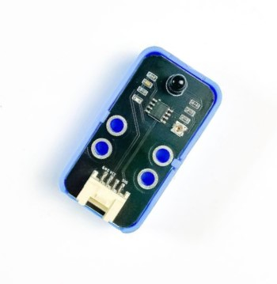
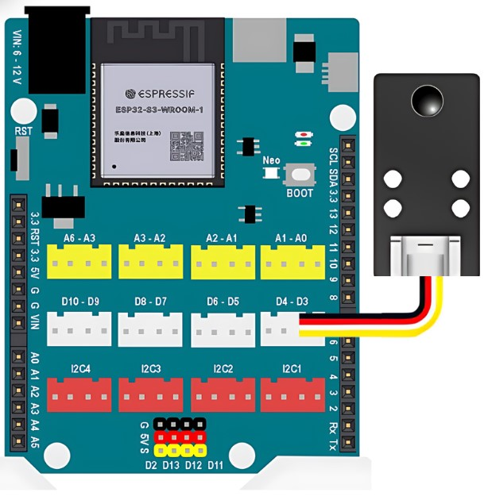

11. Cảm biến lửa 
========

**1. Giới thiệu:** 
---------
-------------

| 

Module cảm biến lửa có 5 kênh tín hiệu, giúp có thể phát hiện lửa ở 5 hướng khác nhau. Cảm biến phát hiện lửa thường được sử dụng cho các ứng dụng sáng tạo như: xe robot chữa cháy, nhà thông minh tự báo động khi phát hiện bị cháy,…

Với hướng dẫn này, sẽ hướng dẫn thực hiện chương trình cảnh báo cháy. 

**Thông số kỹ thuật**

    + Nguồn: 3.3V
    + Kết nối: Digital
    + Khoảng cách: 80cm
    + Góc quét: 60 độ

**2. Chuẩn bị các thiết bị:**
-----------
------------

.. list-table:: 
   :widths: auto
   :header-rows: 1
     
   * - .. image:: images/yolo_uno.png
          :width: 200px
          :align: center
     - .. image:: images/lua.1.jpg
          :width: 200px
          :align: center
   * - Máy tính lập trình Yolo UNO
     - Cảm biến lửa
   * - `Mua sản phẩm <https://ohstem.vn/product/yolo-uno/>`_
     - `Mua sản phẩm <https://ohstem.vn/product/cam-bien-lua/>`_

**3. Kết nối phần cứng**
-----------
------------

- Kết nối cảm biến lửa vào chân D3 - D4: 

|

**4. Hướng dẫn lập trình:**
--------
------------

- **Giới thiệu khối lệnh:**

    .. image:: images/lua.3.jpg
        :scale: 70%
        :align: center 
|

- **Viết chương trình:**

    ..  figure:: images/lua.4.jpg
        :scale: 70%
        :align: center

        `<https://app.ohstem.vn/#!/share/yolouno/2kufoS9swahrQXBXAThSmLEHCvl>`_ 

.. note::

    **Giải thích chương trình:** 

    Chương trình sẽ kiểm tra kết quả nhận được từ cảm biến sau mỗi giây, nếu phát hiện có lửa, đèn led trên board sẽ đổi màu đỏ. Nếu không có lửa, thì tắt đèn.