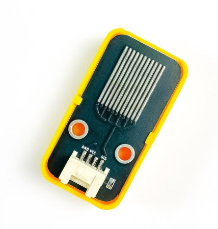
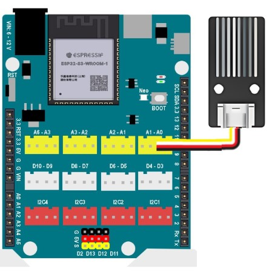

6. Cảm biến nước 
======

**1. Giới thiệu:** 
---------
-------------

| 

Cảm biến nước là cảm biến giúp nhận dạng nước, dễ dàng đo được có nước hay không trên bề mặt bằng các đường mạch song song có trên cảm biến.Cảm biến sẽ chuyển đổi nước nhận được thành các tín hiệu Analog sau đó truyền đến mạch lập trình chính.

Với hướng dẫn này, sẽ lập trình cảm biến kiểm tra có mưa (nước) hay không. Nếu phát hiện có mưa (nước) báo đèn đỏ, ngược lại bật đèn xanh. 

**Thông số kỹ thuật**

    + Điện áp: 3.3V 
    + Tín hiệu: Analog
    + Trọng lượng: 3g

**2. Chuẩn bị các thiết bị:**
-----------
------------

.. list-table:: 
   :widths: auto
   :header-rows: 1
     
   * - .. image:: images/yolo_uno.png
          :width: 200px
          :align: center
     - .. image:: images/nuoc_1.jpg
          :width: 200px
          :align: center
   * - Máy tính lập trình Yolo UNO
     - Cảm biến nước
   * - `Mua sản phẩm <https://shop.ohstem.vn/san-pham/yolo-uno/>`_
     - `Mua sản phẩm <https://shop.ohstem.vn/san-pham/cam-bien-nuoc/>`_

**3. Kết nối phần cứng**
-----------
------------

Kết nối cảm biến nước vào **cổng Analog: A0 - A1** (có thể kết nối các cổng Analog khác từ A0 - A6)

|

**4. Hướng dẫn lập trình:**
--------
------------

- **Giới thiệu khối lệnh:**

    Câu lệnh dùng để phát hiện trên bề mặt cảm biến có nước hay không.

    .. image:: images/nuoc_3.jpg
        :scale: 100%
        :align: center 
    |

- **Viết chương trình:**

    ..  figure:: images/nuoc_4.jpg
        :scale: 80%
        :align: center

        `<https://app.ohstem.vn/#!/share/yolouno/2ksC8D6nE7S83ppJeoYz5op4Len>`_ 

.. note::

    **Giải thích chương trình:** 

    Nếu cảm biến nước ở chân A0 phát hiện có nước trên bề mặt cảm biến, đèn led trên board sẽ chuyển sang màu đỏ. Ngược lại, thì tắt đèn. 

