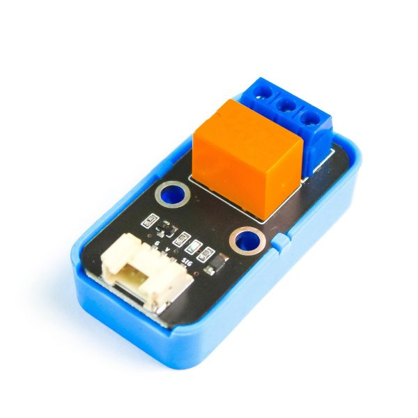
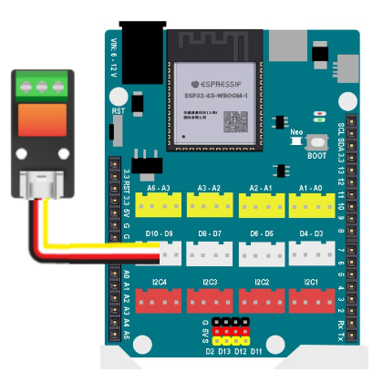
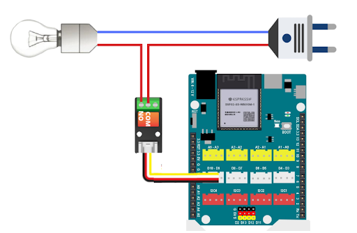

8. Relay
=========

**1. Giới thiệu:** 
---------
-------------

| 

Relay là một công tắc điện tử có thể sử dụng để đóng tắt nguồn cho một thiết bị, hoạt động giống với công tắc cơ mà chúng ta thường sử dụng trong dân dụng. Tuy nhiên, nó có thể điều khiển đóng ngắt bằng cách lập trình. 

Với hướng dẫn này, sẽ thực hiện chương trình đổi trạng thái của relay để bật tắt bóng đèn 220V. 

**Thông số kỹ thuật**

    + Điện áp: 3.3V
    + Dòng chịu đựng: 3A
    + Không có bảo vệ ngược cực, cần chú ý khi cấp nguồn
    + Tín hiệu điều khiển: Digital

**2. Chuẩn bị các thiết bị:**
-----------
------------

.. list-table:: 
   :widths: auto
   :header-rows: 1
     
   * - .. image:: images/yolo_uno.png
          :width: 200px
          :align: center
     - .. image:: images/relay.1.jpg
          :width: 200px
          :align: center
     - .. image:: images/relay.2.jpg
          :width: 200px
          :align: center
   * - Máy tính lập trình Yolo UNO
     - Relay
     - Bóng đèn 220V, phích cắm và dây điện
   * - `Mua sản phẩm <https://shop.ohstem.vn/san-pham/yolo-uno/>`_
     - `Mua sản phẩm <https://shop.ohstem.vn/san-pham/cam-bien-am-thanh/>`_

**3. Kết nối phần cứng**
-----------
------------

- Kết nối **Relay vào cổng Digital: D9 - D10**

|

- Kết nối Relay với bóng đèn 220V và phích cắm điện.  

    **Cách kết nối:** Một chân của đèn nối vào nguồn, chân còn lại sẽ ngắt ra làm 2, để nối vào chân COM và NO của Relay, như hình minh hoạt sau đây.

|

**4. Hướng dẫn lập trình:**
--------
------------

- **Giới thiệu khối lệnh:**

    Câu lệnh dùng để thay đổi trạng thái của relay

    .. image:: images/relay.5.jpg
        :scale: 50%
        :align: center 
|

- **Viết chương trình:**

    ..  figure:: images/relay.6.jpg
        :scale: 60%
        :align: center

        `<https://app.ohstem.vn/#!/share/yolouno/2kuHtQzlQPDAeBYSYHEw6GvfXrV>`_ 

|

    Sau khi gửi chương trình xuống Yolo UNO, cắm phích điện vào nguồn điện, bóng đèn sẽ bật tắt sau mỗi 2 giây. Hãy cẩn thận khi sử dụng điện!

