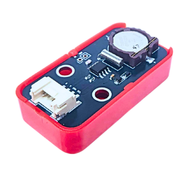
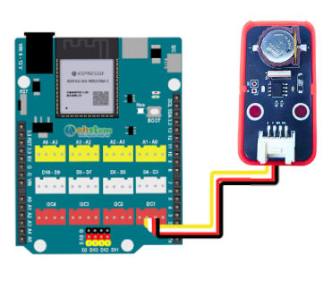
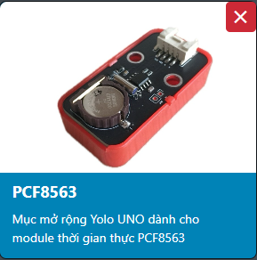
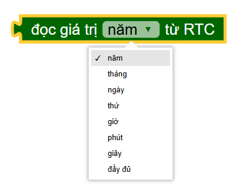
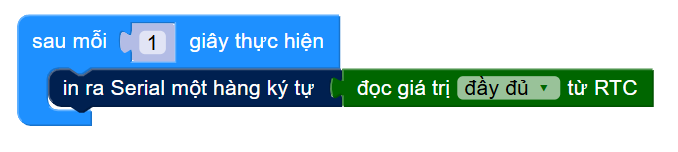

16. Module thời gian thực RTC PCF8563 (Real-Time Clock)
========

| 

Module RTC PCF8563 là một mạch tích hợp (IC) đồng hồ/lịch thời gian thực CMOS công suất cực thấp, được thiết kế để cung cấp thông tin thời gian (giây, phút, giờ, ngày, thứ, tháng, năm) cho các hệ thống nhúng. Điểm nổi bật của PCF8563 là khả năng tiêu thụ điện năng cực thấp và dải điện áp hoạt động rộng, lý tưởng cho các ứng dụng chạy bằng pin hoặc cần tối ưu năng lượng.
Module này sử dụng giao tiếp I2C, một chuẩn truyền thông phổ biến giúp đơn giản hóa việc kết nối chỉ với hai đường tín hiệu (SDA và SCL), cùng với nguồn và đất. Nhờ có một pin dự phòng nhỏ (thường là CR1220), PCF8563 có thể tiếp tục giữ thời gian chính xác ngay cả khi nguồn cấp chính cho vi điều khiển bị ngắt.
Đặc điểm nổi bật của PCF8563:
+ Đồng hồ thời gian thực tích hợp: Cung cấp thông tin giây, phút, giờ, ngày, thứ, tháng, năm.
+ Tiêu thụ điện năng cực thấp: Rất phù hợp cho các thiết bị chạy pin.
+ Pin dự phòng: Đảm bảo duy trì thời gian liên tục.
+ Giao tiếp I2C: Dễ dàng kết nối và sử dụng với hầu hết các vi điều khiển.
+ Chức năng báo thức (Alarm) và Ngắt (Interrupt): Khả năng tạo ra ngắt tại các thời điểm cài đặt.

**1. Thông số kỹ thuật**
---------
------------

- **Thông số kỹ thuật**

    + Điện áp đầu vào: 3.3V
    + Giao tiếp: I2C
    + Địa chỉ I2C: 0x51 (Địa chỉ I2C cố định của PCF8563)
    + Pin dự phòng: CR1220 (Thường đi kèm module, có thể thay thế)
    + Dòng điện tiêu thụ: Cực thấp (nanometer), lý tưởng cho ứng dụng năng lượng thấp
    + Các chân kết nối: VCC, GND, SDA, SCL
    + Nhiệt độ hoạt động: -40 – 85 ℃

- **Pinout của module**

Module RTC có 4 chân, và mỗi chân có chức năng như sau:

..  csv-table:: 
    :header: "STT", "Chân", "Chức năng"
    :widths: 10, 15, 30

    1, "GND", "Nối đất"
    2, "VCC", "Cấp nguồn (3.3V)"
    3, "SCL", "Chân xung nhịp"
    4, "SDA", "Chân dữ liệu"

**2. Kết nối**
------------
------------

- **Bước 1**: Chuẩn bị các thiết bị như sau: 

.. list-table:: 
   :widths: auto
   :header-rows: 1
     
   * - .. image:: images/yolo_uno01.png
          :width: 200px
          :align: center
     - .. image:: images/rtc01.png
          :width: 200px
          :align: center
   * - Máy tính lập trình Yolo UNO
     - Module RTC
   * - `Mua sản phẩm <https://shop.ohstem.vn/san-pham/yolo-uno/>`_
     - `Mua sản phẩm <https://shop.ohstem.vn/san-pham/module-gps//>`_

- **Bước 2**: Kết nối dây tín hiệu với module vào Yolo UNO như hình: 

    Module RTC sẽ kết nối với mạch Yolo UNO ở cổng I2C (có thể dùng bất kỳ cổng I2C nào trên mạch) theo mẫu.

**3. Lập trình module RTC với Yolo UNO trên OhStem App**
--------
------------

Để lập trình module RTC, chúng ta phải cần thêm thư viện mở rộng RTC, bạn vào mục mở rộng và dán liên kết này `https://github.com/AITT-VN/yolouno_extension_rtc_pcf8563.git` để tải thư viện mở rộng **RTC**.

    Xem hướng dẫn tải thư viện `tại đây <https://docs.ohstem.vn/en/latest/module/thu-vien-yolobit.html>`_.

| 

**Chương trình cơ bản để lấy tín hiệu từ RTC:**

Đầu tiên chúng ta sẽ khởi tạo module RTC bằng cách cài đặt thời gian vào cho module trước

Các thông tin chúng ta có thể đọc được từ RTC sẽ bao gồm các thông tin như sau : 

Chương trình đơn giản để kiểm tra thời gian định kì mỗi 1 giây sẽ như sau:

 
**Lưu ý**
 + Module chỉ cần khởi tạo thời gian 1 lần đầu dùng, khi nạp lại chương trình thì nên **xóa câu lệnh cài đặt thời gian** để thời gian được chạy tiếp tục tính từ lúc cài đặt 

**Chương trình tham khảo** `tại đây <https://app.ohstem.vn/#!/share/yolouno/2yleXNJHFK6YXNu1x9bUeYAkp69>`_.