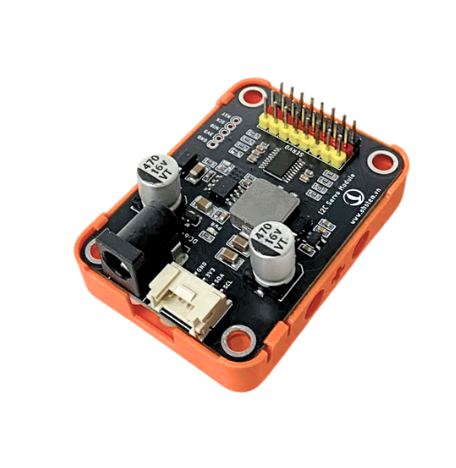
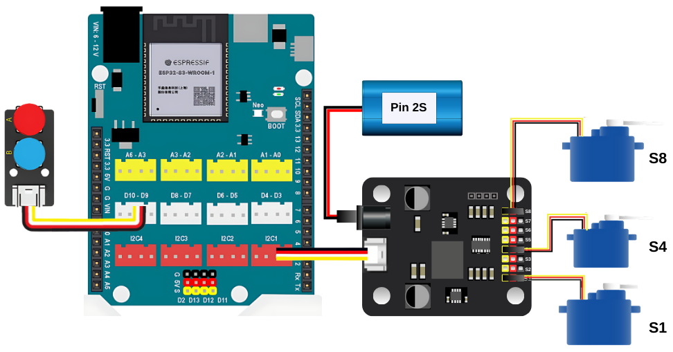

5. Module servo 8 kênh I2C
=========

**1. Giới thiệu**
---------
------------

|

**Module servo 8 kênh I2C** là một module cho phép điều khiển **đồng thời tối đa 8 động cơ servo** thông qua kết nối với các bộ vi điều khiển như  Yolo UNO. Mạch sử dụng giao tiếp I2C, giúp tiết kiệm chân kết nối và dễ dàng mở rộng khi xây dựng các dự án có nhiều động cơ servo.

Một vài ứng dụng có thể sử dụng module này như: Hệ thống mở cửa tự động với nhiều cửa, mô hình robot nhiều khớp, cánh tay robot... Trong hướng dẫn này, chúng tôi sẽ hướng dẫn bạn kết nối module này với mạch lập trình cơ bản Yolo:Bit và Yolo UNO.

**2. Thông số kỹ thuật**
---------
------------

- Hỗ trợ nguồn pin ~6 - 12V
- Hỗ trợ điều khiển 8 servo độc lập
- Giao tiếp I2C

 
**3. Kết nối phần cứng**
---------
------------   

- **Chuẩn bị các thiết bị**, bạn có thể chuẩn bị Yolo UNO và các thiết bị như bên dưới: 

.. list-table:: 
   :widths: auto
   :header-rows: 1
     
   * - .. image:: images/yolo_uno.png
          :width: 200px
          :align: center
     - .. image:: images/servo_8_kenh.png
          :width: 150px
          :align: center
     - .. image:: images/servo_8_kenh_2.png
          :width: 250px
          :align: center
     - .. image:: images/nut_nhan_doi.png
          :width: 120px
          :align: center
     - .. image:: images/pin2s.png
          :width: 150px
          :align: center
   * - Mạch lập trình Yolo UNO
     - Module Module servo 8 kênh I2C
     - Servo 180 độ
     - Nút nhấn đôi (Dành cho kết nối với Yolo UNO )
     - Pin 2S
   * - `Mua sản phẩm <https://ohstem.vn/product/yolo-uno/>`_
     - `Mua sản phẩm <https://ohstem.vn/product/module-servo-8-kenh-i2c/>`_
     - `Mua sản phẩm <https://ohstem.vn/product/dong-co-servo-mg90s/>`_
     - `Mua sản phẩm <https://ohstem.vn/product/nut-nhan-doi/>`_
     - `Mua sản phẩm <https://ohstem.vn/product/pin-sac-2s-dung-cho-robot-orc-k2/>`_

- **Kết nối với Yolo UNO:**

    *Kết nối vào cổng I2C trên mạch Yolo UNO*
|

4. Lập trình với Yolo UNO
--------
------------

1. Tải thư viện **SERVO8CHS Kit**, bằng cách dán đường link sau vào phần tìm kiếm thư viện: `<https://github.com/AITT-VN/yolouno_extension_servo8chs>`_

    Xem hướng dẫn tải thư viện `tại đây <https://docs.ohstem.vn/en/latest/module/thu-vien-yolouno.html>`_

    ..  figure:: images/servo_8_kenh_5.png
        :scale: 60%
        :align: center 
    |

    Thư viện sẽ gồm các câu lệnh điều khiển servo như sau:

    ..  figure:: images/servo_8_kenh_6.png
        :scale: 100%
        :align: center 
    |   

2. **Viết chương trình:**

**2.1. Điều khiển servo quay đến góc cố định**

    Khối lệnh điều khiển servo quay tới góc chỉ định với tốc độ tùy chỉnh:

    ..  figure:: images/servo_8_kenh_14.png
        :scale: 70%
        :align: center 

    Mỗi servo ứng với tên từ MS1-MS8, chúng ta sẽ thay đổi thông số góc trong khoảng từ 0-180 độ và tốc độ tùy chỉnh từ 1-100

    Chương trình điều khiển 3 servo kết nối với 3 chân trên mạch Yolo UNO được thực hiện như sau:

    ..  figure:: images/servo_8_kenh_15.png
        :scale: 70%
        :align: center 

        Link chương trình: `<https://app.ohstem.vn/#!/share/yolouno/2vTYp3OUG9U3UakHnH8ZpozoYuj>`_      

    .. note::  
        Khi nhấn nút A tại chân D9, cả 3 động cơ **servo 180 độ** sẽ quay đồng thời đến **góc 90 độ** với **tốc độ 100**. Ngược lại, khi nhấn nút B ở chân D10, các servo sẽ quay trở lại **góc 0 độ** cũng với tốc độ tương tự.  

        Dựa trên chương trình mẫu này, bạn hoàn toàn có thể **điều khiển từng động cơ servo một cách độc lập**, thiết lập **góc quay và tốc độ phù hợp** với từng nhiệm vụ cụ thể – chẳng hạn như đóng/mở cửa, điều khiển cánh tay robot, hay các chuyển động phức tạp khác trong mô hình của bạn.

**2.2. Quay servo thêm một góc nhỏ**

    Khối lệnh điều khiển servo quay thêm một góc nhỏ tùy chỉnh để tăng độ chính xác trong quá trình thực hiện dự án: 

    ..  figure:: images/servo_8_kenh_9.png
        :scale: 70%
        :align: center 
    |
    Chương trình được thực hiện như sau: 

    ..  figure:: images/servo_8_kenh_16.png
        :scale: 50%
        :align: center 

        Link chương trình: `<https://app.ohstem.vn/#!/share/yolouno/2vTYyjogcyl3m8RIkyLVqDhsSml>`_

    .. note:: 

        Với chương trình này, người dùng chỉ cần nhất nút Boot trên Yolo UNO, các servo sẽ quay thêm 1 góc nhỏ là 5 độ. 

        Ngoài ra, người dùng có thể cho servo quay thêm 1 góc nhỏ hoặc quay lùi bằng cách thêm dấu trừ "**-**" trước góc cần quay. 

            ..  figure:: images/servo_8_kenh_11.png
                :scale: 70%
                :align: center 

                Quay lùi một góc 5 độ

**2.3. Điều khiển servo 360 độ**

    Chương trình này chỉ phù hợp với servo 360 độ, người dùng cần lưu ý khi chọn servo để thực hiện. Việc kết nối vào các cổng của mạch lập trình được thực hiện tương tự như phần kết nối. 

    Câu lệnh điều khiển servo 360 độ: 

    ..  figure:: images/servo_8_kenh_12.png
        :scale: 70%
        :align: center 
    |
    Chương trình điều khiển tốc độ quay của servo 360 độ: 

    ..  figure:: images/servo_8_kenh_17.png
        :scale: 60%
        :align: center 

        Link chương trình: `<https://app.ohstem.vn/#!/share/yolouno/2vTZCgMLoZYTgMxDam3XvhdKE6I>`_

    .. note:: 

        Khi nhấn nút A tại chân D9, servo 360 độ quay với tốc độ 100. 
        Khi nhấn nút B tại chân D10, servo quay lùi tốc độ 100. 
        Khi nút Boot trên Yolo UNO, servo dừng hoạt động. 

