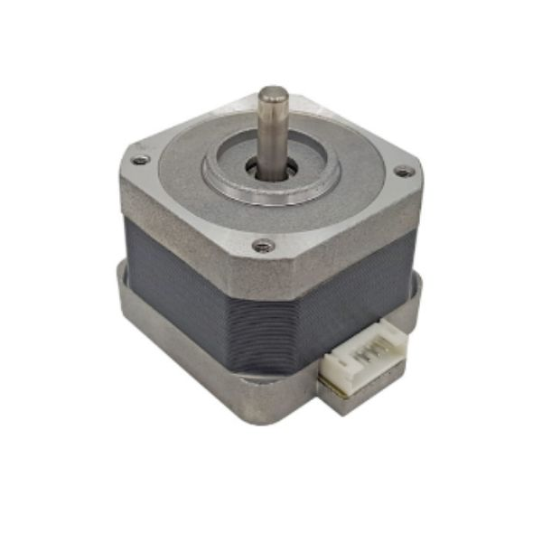

3. Động cơ bước 
==========

**1. Giới thiệu:** 
---------
-------------

| 

Động cơ bước thường được ứng dụng trong các dự án về robot, các cơ cấu chuyển động với sự di chuyển chính xác như máy in, máy CNC, in 3D…

Để sử dụng động cơ bước với Yolo UNO cần sử dụng thêm một mạch điều khiển động cơ đi kèm như hình: 

.. image:: images/dong-co-buoc.2.jpg
    :width: 400px
    :align: center 

Với hướng dẫn này, chúng ta sẽ thực hiện chương trình điều khiển động cơ bước di chuyển tới và lùi.

**Thông số kỹ thuật:**

- Kích thước: 42x42x38, chuẩn 4 dây tín hiệu
- Đường kính trục: 5mm 
- Dây nối dài 30cm, đầu dây chuẩn XH2.54. Tương thích với đầu ra động cơ bước trên mạch RAMPS 1.5 hoặc CNC shield V3
- Dòng: 1.2A
- Bước: 1.8° 
- Momen xoắn: 400Nm 
- Trọng lượng: 300gr

**2. Chuẩn bị các thiết bị:**
-----------
------------

.. list-table:: 
   :widths: auto
   :header-rows: 1
     
   * - .. image:: images/yolo_uno.png
          :width: 200px
          :align: center
     - .. image:: images/dong-co-buoc.1.jpg
          :width: 200px
          :align: center
     - .. image:: images/dong-co-buoc.2.jpg
          :width: 200px
          :align: center
   * - Máy tính lập trình Yolo UNO
     - Động cơ bước 
     - Mạch điều khiển động cơ
   * - `Mua sản phẩm <https://ohstem.vn/product/yolo-uno/>`_
     - `Mua sản phẩm <https://ohstem.vn/product/dong-co-buoc-step-nema-17-size-42-kem-day-40cm/>`_
     - `Mua sản phẩm <https://ohstem.vn/product/module-dieu-khien-dong-co/>`_    

**3. Kết nối phần cứng**
-----------
------------

- Kết nối mạch động cơ vào cổng I2C trên Yolo UNO
- Kết nối động cơ bước vào cổng STEP1 trên mạch động cơ

|

**4. Hướng dẫn lập trình:**
--------
------------

- **Tải thư viện Motors Driver V1**, xem hướng dẫn tải thư viện `tại đây <https://docs.ohstem.vn/en/latest/module/thu-vien-yolouno.html>`_  

|

Các khối lệnh sau để làm việc với cảm biến:

|

- **Viết chương trình**: 

    `<https://app.ohstem.vn/#!/share/yolouno/2kxAuqIBnHPEamjj52u5poS7zFc>`_

.. note::

    **Giải thích chương trình:** 

    Chương trình sẽ điều khiển động cơ bước quay tới tốc độ 200 trong 2 giây, sau đó quay ngược lại với tốc độ 200 trong 2 giây và lặp lại.
