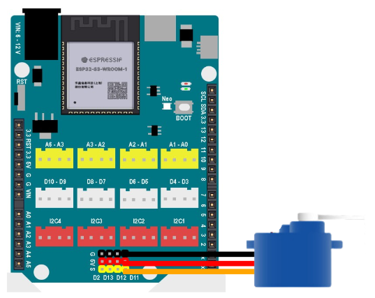

2. Servo SG90S 180 độ
========

**1. Giới thiệu:** 
---------
-------------

.. image:: images/servo_180.1.png
    :width: 400px
    :align: center 
| 

Động cơ servo SG90S 180 độ, thường được sử dụng trong các dự án như di chuyển khớp cánh tay của robot, hỗ trợ nâng hạ nắp thùng rác thông minh đóng mở tự động… 

Với hướng dẫn này, sẽ thực hiện thay đổi góc của động cơ có thể áp dụng vào dự án thùng rác thông minh hay cửa tự động….

**2. Chuẩn bị các thiết bị:**
-----------
------------

.. list-table:: 
   :widths: auto
   :header-rows: 1
     
   * - .. image:: images/yolo_uno.png
          :width: 200px
          :align: center
     - .. image:: images/servo_180.1.png
          :width: 200px
          :align: center
   * - Máy tính lập trình Yolo UNO
     - Động cơ servo
   * - `Mua sản phẩm <https://shop.ohstem.vn/san-pham/yolo-uno/>`_
     - `Mua sản phẩm <https://shop.ohstem.vn/san-pham/dong-co-servo-sg90s/>`_

**3. Kết nối phần cứng**
-----------
------------

- Kết nối màn hình led 7 đoạn vào cổng D3 - D4:

|

**4. Hướng dẫn lập trình:**
--------
------------

- **Giới thiệu khối lệnh**: 

Câu lệnh điều khiển góc xoay của servo từ 0 - 180 độ.

|

- **Viết chương trình**: 

    `<https://app.ohstem.vn/#!/share/yolouno/2kurd0quvU3HNHcKM55G5Nkc5oF>`_ 

.. note::

    **Giải thích chương trình:** 

    Sau mỗi 2 giây, động cơ servo sẽ quay từ góc 90 sang 0 độ và ngược lại.  