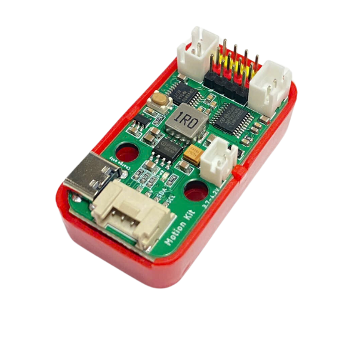
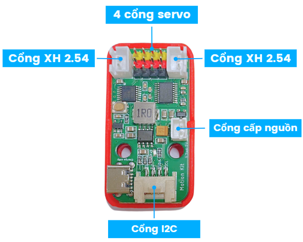
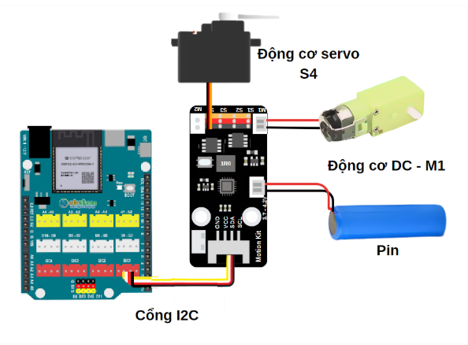
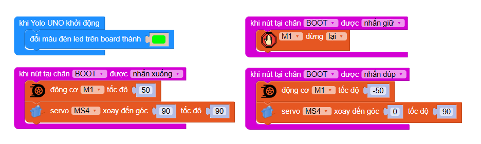

4. Mạch mở rộng Motion Kit
=========

**1. Giới thiệu**
---------
------------

|

Mạch mở rộng Motion Kit là một công cụ giúp nâng cao khả năng mở rộng cho mạch Yolo UNO, cho phép mở rộng cổng kết nối động cơ một cách dễ dàng. Nhờ có Motion Kit, Yolo UNO có thể tích hợp thêm các cơ cấu servo, động cơ và nhiều cơ cấu sáng tạo khác từ bạn.

Với 4 cổng động cơ servo, 2 cổng động cơ XH 2.54, 1 cổng cấp nguồn và 1 cổng Grove, Motion Kit mang đến sự linh hoạt tối ưu trong việc kết nối và điều khiển nhiều loại động cơ khác nhau.

|

Trong hướng dẫn này, chúng tôi sẽ hướng dẫn bạn cách kết nối thêm 1 động cơ DC và 1 động cơ servo với Yolo UNO, giúp bạn mở rộng thêm cơ cấu sản phẩm của mình. 

**2. Thông số kỹ thuật**
---------
------------

- Hỗ trợ nguồn pin 3.7V
- Tích hợp mạch sạc
- Hỗ trợ động cơ DC dưới 6V

 
**3. Kết nối phần cứng**
---------
------------   

- **Bước 1**: Chuẩn bị các thiết bị như sau: 

.. list-table:: 
   :widths: auto
   :header-rows: 1
     
   * - .. image:: images/motion-kit.1.png
          :width: 150px
          :align: center
     - .. image:: images/yolo_uno.png
          :width: 400px
          :align: center
     - .. image:: images/servo.png
          :width: 400px
          :align: center
     - .. image:: images/dong-co-dc.png
          :width: 200px
          :align: center
   * - Motion Kit (kèm dây tín hiệu)
     - Yolo UNO
     - Động cơ servo
     - Động cơ DC giảm tốc 6V
   * - Mua sản phẩm
     - `Mua sản phẩm <https://ohstem.vn/product/yolo-uno/>`_
     - `Mua sản phẩm <https://ohstem.vn/product/dong-co-servo-mg90s/>`_
     - `Mua sản phẩm <https://ohstem.vn/product/dong-co-dc-giam-toc-6v/>`_

- **Bước 2**: Kết nối các thiết bị như hình
    
    + Kết nối Motion Kit vào cổng I2C trên Yolo UNO
    + Trên Motion Kit kết nối: 
        - Servo vào cổng S4
        - Động cơ DC vào cổng M1 
        - Pin vào cổng nguồn

|

**5. Hướng dẫn lập trình**
--------
------------

1. Tải thư viện **Motion Kit**, bằng cách dán đường link sau vào phần tìm kiếm thư viện: `<https://github.com/AITT-VN/yolouno_extension_motionkit.git>`_

    Xem hướng dẫn tải thư viện `tại đây <https://docs.ohstem.vn/en/latest/module/thu-vien-yolobit.html>`_

    ..  figure:: images/motion-kit.4.png
        :scale: 80%
        :align: center 
    |

    Thư viện sẽ gồm các câu lệnh điều khiển 2 động cơ và 4 servo:

    ..  figure:: images/motion-kit.5.png
        :scale: 80%
        :align: center 
    |   

2. **Viết chương trình:**

**2.1. Chương trình kiểm tra hoạt động của Motion Kit và các động cơ mở rộng:**

    Với chương trình mẫu sau, bạn có thể dùng nút Boot trên Yolo UNO để điều khiển module mở rộng Motion Kit:

    Link chương trình: `<https://app.ohstem.vn/#!/share/yolouno/2q3n97ice8I61lZzjj2dF73acPs>`_      

.. note:: 
    Khi nhấn nút Boot, động cơ M1 sẽ quay với tốc độ 50, đồng thời servo 4 sẽ quay đến vị trí 90. Khi ấn đúp (ấn 2 lần) nút B thì động cơ M1 với tốc độ 50 và servo 4 sẽ quay về vị trí 0. Khi ấn giữ nút Boot thì động cơ M1 sẽ dừng quay.
