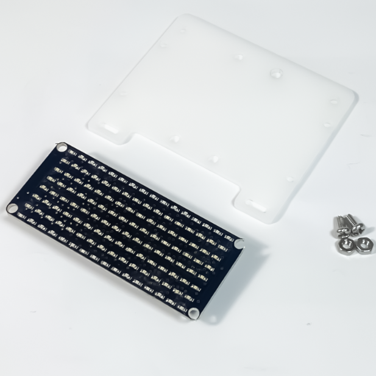
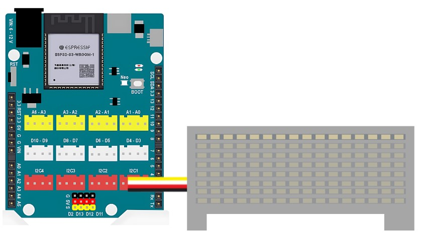
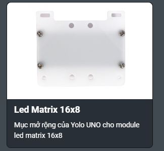
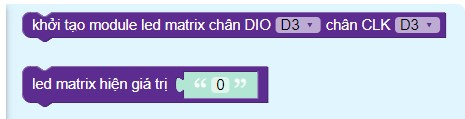
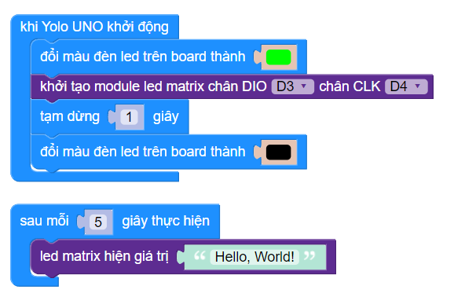

5. LED 16x8
============

**1. Giới thiệu:** 
---------
-------------

| 

LED ma trận (16 x 8) có tổng cộng 128 LED đơn được căn chỉnh. Màn hình LED có màu xanh dương. Bằng cách lập trình từ nhiều ngôn ngữ khác nhau, bạn có thể lập trình để đèn LED ma trận chạy chữ, số hoặc ký hiệu tùy thích.

**Thông số kỹ thuật**

    + Điện áp: 3.3V
    + Giao tiếp: I2C
    + Kích thước module: 73 x 31 x 15 mm (DxRxC)

**2. Chuẩn bị các thiết bị:**
-----------
------------

.. list-table:: 
   :widths: auto
   :header-rows: 1
     
   * - .. image:: images/yolo_uno.png
          :width: 200px
          :align: center
     - .. image:: images/led_16x8.1.png
          :width: 200px
          :align: center
   * - Máy tính lập trình Yolo UNO
     - Led ma trận 16x8
   * - `Mua sản phẩm <https://shop.ohstem.vn/san-pham/yolo-uno/>`_
     - `Mua sản phẩm <https://shop.ohstem.vn/san-pham/led-ma-tran-16-8/>`_

**3. Kết nối phần cứng**
-----------
------------

- Kết nối màn hình LED 16x8 vào cổng I2C: 

|

**4. Hướng dẫn lập trình:**
--------
------------

- **Tải thư viện LED Matrix 16x8**, bằng các dán đường link bên dưới vào mục tìm kiến thư viện: 

    `<https://github.com/AITT-VN/yolouno_extension_led_matrix_8x16.git>`_ 
    
    Xem hướng dẫn tải thư viện `tại đây <https://docs.ohstem.vn/en/latest/module/thu-vien-yolouno.html>`_  

|

Các khối lệnh sau để làm việc với cảm biến:

|

- **Viết chương trình**: 

    `<https://app.ohstem.vn/#!/share/yolouno/2kxUASfJ7N6nAGgzV6GcSu5oQ3K>`_

.. note::

    **Giải thích chương trình:** 

    Sau mỗi 5 giây, màn hình sẽ hiện dòng chữ “Hello, World!”