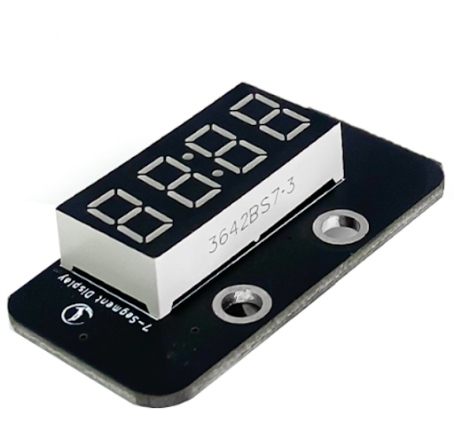
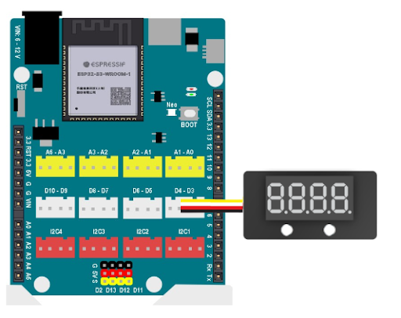
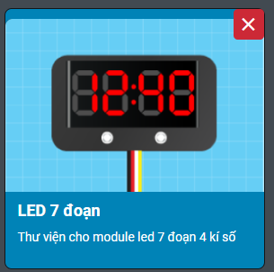
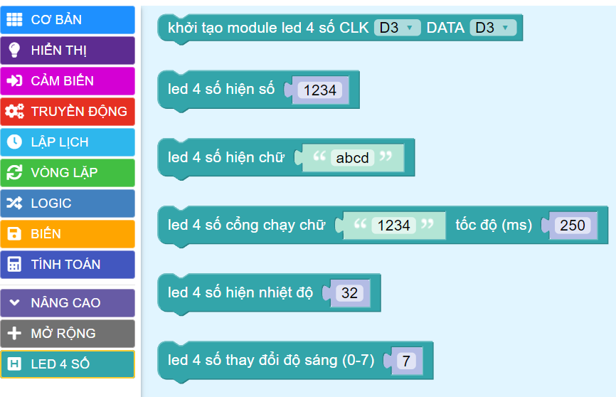
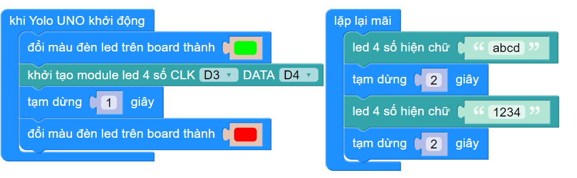

3. Màn hình 4 số LED 7 đoạn
=========

**1. Giới thiệu:** 
---------
-------------

| 

Màn hình 4 số LED 7 đoạn sử dụng LED 7 đoạn anode chung 4 chữ số để hiển thị các số và một vài ký tự đặc biệt. Module có thể được sử dụng trong những dự án để hiển thị các dữ liệu như tốc độ, thời gian, điểm số, nhiệt độ, khoảng cách, v.v.

Với hướng dẫn này, sẽ sử dụng màn hình LED 7 đoạn này để hiển thị một vài kí tự như số 1234, abcd…

**Thông số kỹ thuật**

    + Điện áp hoạt động: 3.3V
    + Số led 7 đoạn: 4
    + Điều khiển: Sử dụng 2 chân tín hiệu DIO, CLK
    + Driver chip: TM1637
    + Màu đoạn led kỹ thuật số: Đỏ

**2. Chuẩn bị các thiết bị:**
-----------
------------

.. list-table:: 
   :widths: auto
   :header-rows: 1
     
   * - .. image:: images/yolo_uno.png
          :width: 200px
          :align: center
     - .. image:: images/led_7_doan.1.png
          :width: 200px
          :align: center
   * - Máy tính lập trình Yolo UNO
     - Led 7 đoạn
   * - `Mua sản phẩm <https://ohstem.vn/product/yolo-uno/>`_
     - `Mua sản phẩm <https://ohstem.vn/product/led-7-doan/>`_

**3. Kết nối phần cứng**
-----------
------------

- Kết nối màn hình LED 7 đoạn vào cổng D3 - D4:

|

**4. Hướng dẫn lập trình:**
--------
------------

- **Tải thư viện LED 7 đoạn**, xem hướng dẫn tải thư viện `tại đây <https://docs.ohstem.vn/en/latest/module/thu-vien-yolouno.html>`_  

|

Các khối lệnh sau để làm việc với cảm biến:

|

- **Viết chương trình**: 

    `<https://app.ohstem.vn/#!/share/yolouno/2kuqFIc5kvEAOfxdxGxUas92t0W>`_

    *Lưu ý: Khi chọn chân lập trình, chân CLK là chân D3, chân Data là D4.*  

.. note::

    **Giải thích chương trình:** 

    Sau khi khởi động, màn hình sẽ hiển thị các kí “abcd” và “1234” sau mỗi 2 giây.