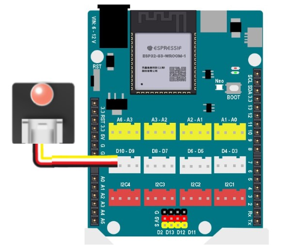

4. Đèn LED đơn 
==========

**1. Giới thiệu:** 
---------
-------------

.. image:: images/led_don.1.png
    :width: 400px
    :align: center 
| 

LED đơn là một tín hiệu ngõ ra, khi được cấp nguồn điện vào thì đèn LED sẽ bật. Đèn LED đơn thường được sử dụng để thông báo trạng thái (ví dụ như làm đèn giao thông) hoặc dùng làm đèn cửa, đèn chiếu sáng,…

Với hướng dẫn này, sẽ thực hiện chương trình chớp tắt đèn LED đơn. 

**Thông số kỹ thuật**

    + Hỗ trợ cả 3.3V
    + Đèn LED đơn thường có 3 màu: đỏ, xanh lá, vàng

**2. Chuẩn bị các thiết bị:**
-----------
------------

.. list-table:: 
   :widths: auto
   :header-rows: 1
     
   * - .. image:: images/yolo_uno.png
          :width: 200px
          :align: center
     - .. image:: images/led_don.1.png
          :width: 200px
          :align: center
   * - Máy tính lập trình Yolo UNO
     - Led đơn
   * - `Mua sản phẩm <https://shop.ohstem.vn/san-pham/yolo-uno/>`_
     - `Mua sản phẩm <https://shop.ohstem.vn/san-pham/den-led-don/>`_

**3. Kết nối phần cứng**
-----------
------------

- Kết nối màn hình led 7 đoạn vào cổng D3 - D4:

|

**4. Hướng dẫn lập trình:**
--------
------------

- **Giới thiệu khối lệnh**: 

Câu lệnh thay đổi trạng thái của đèn LED đơn

|

- **Viết chương trình**: 

    `<https://app.ohstem.vn/#!/share/yolouno/2kuvIA9y9J91mj9LwRVdycucyfa>`_ 

.. note::

    **Giải thích chương trình:** 

    Sau khi gửi chương trình, đèn LED đơn sẽ chớp tắt sau mỗi 1 giây. 