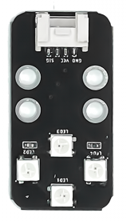
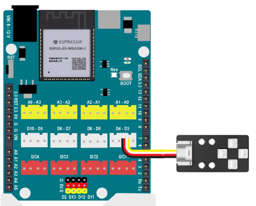
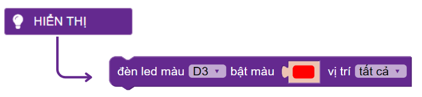
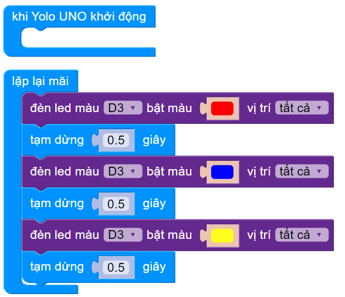

1. Đổi màu đèn Tiny RGB 
========

1. Mục tiêu
-----
--------

Viết chương trình điều khiển module LED RGB thay đổi thành các màu khác nhau

2. Thiết bị cần sử dụng
---------
----------

- Mạch Yolo UNO:

..  image:: images/yolo_uno.png
    :scale: 60%
    :align: center 
|

- Module led RGB kèm dây tín hiệu: 

|

3. Kết nối phần cứng
-------
--------

Kết nối module led RGB vào chân D3 của Yolo UNO

|

4. Chương trình lập trình
------
------

- **Giới thiệu các câu lệnh:**

|

Bạn có thể lựa chọn chân điều khiển, màu và các led trên module sáng khác nhau.

- **Chương trình lập trình:**

|

5. Chương trình mẫu
----
-----

Nhấp vào chữ tại đây để xem chương trình mẫu, hoặc quét mã QR bên dưới để xem chương trình.

Đổi màu đèn Tiny RGB: `Tại đây <https://app.ohstem.vn/#!/share/yolouno/2aLdNslU89atlJwHIYqDmjEiNQB>`_

|

