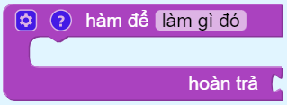

Tạo hàm có giá trị hoàn trả
==========

Tạo một hàm có giá trị hoàn trả.

Khi đó, để gọi hàm này ta sử dụng khối:

Và khối sau dùng để hoàn trả 1 giá trị nào đó khi điều kiện đúng

Ví dụ
----------------------

Đang cập nhật...