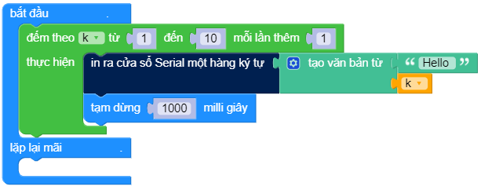

In một chuỗi - bắt đầu dòng mới
==========

In ra cửa sổ serial một hàng kí tự, bắt đầu dòng mới sau đó.

Ví dụ
----------------------

Thực hiện đoạn code sau và so sánh kết quả với khối serial đầu tiên

