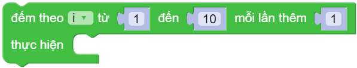
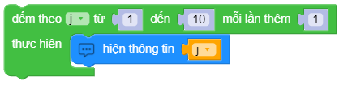

for i in range(start, end):
==========

Cho biến ``i`` lấy giá trị từ số bắt đầu ``start`` đến số kết thúc ``end``, đếm theo khoảng thời gian (tính theo giây) đã chỉ định và thực hiện các khối lệnh được chỉ định.

Ví dụ
----------------------

Hiện lên màn hình từ 1 đến 10

