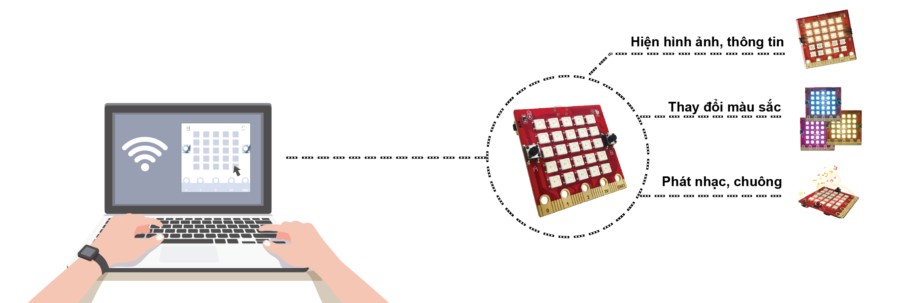

Ví dụ - Kết Nối Yolo:Bit Đến Máy Tính Qua Wifi
==========

Với kết nối WiFi, Yolo:Bit dễ dàng gửi nhận thông tin qua lại với máy tính. Bạn thử nghĩ xem, nếu ta ngồi một chỗ dùng máy tính hoặc điện thoại và có thể điều khiển của Yolo:Bit làm theo ý mình dù ở bất kỳ đâu thì thật là hay phải không. Các hệ thống điều khiển nhà thông minh đều hoạt động theo cách này.

Tham khảo toàn bộ hướng dẫn cách sử dụng bảng điều khiển và lập trình cho Yolo:Bit giao tiếp với máy tính qua WiFi tại `đây <https://ohstem.vn/lp-courses/lap-trinh-stem/lap-trinh-ket-noi-voi-yolobit/lessons/gioi-thieu-bang-dieu-khien/>`_   