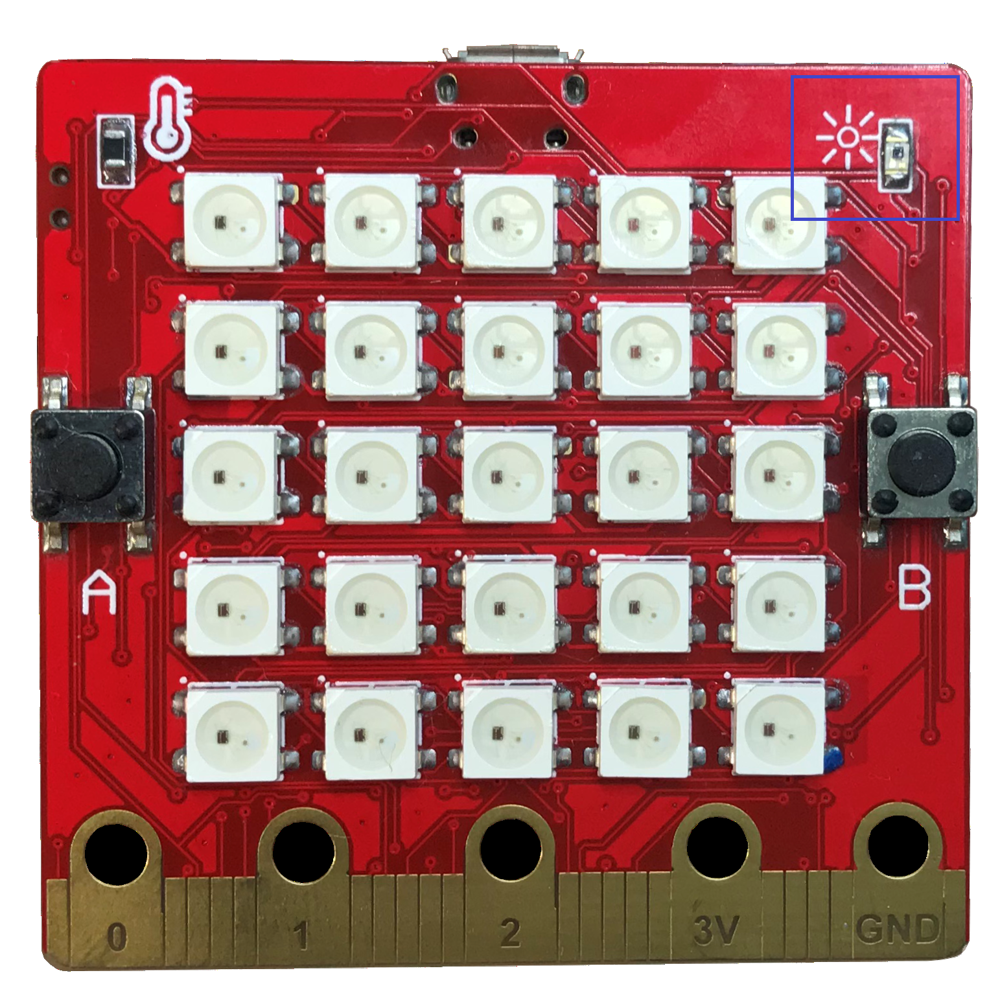

Các cảm biến
=============================================

Yolo:Bit của bạn được tích hợp sẵn nhiều cảm biến với các chức năng khác nhau như cảm biến cử chỉ, cảm biến ánh sáng, cảm biến nhiệt độ. Chúng ta thử tìm hiểu cách làm việc với chúng nào.

.. image:: images/ls-5-1.png
    :width: 600
    :align: center

**Cảm biến cử chỉ**

Cảm biến cử chỉ (hay còn gọi là gia tốc kế) giúp đo được sự di chuyển của Yolo:Bit thông qua 3 chiều:

  X – nghiêng qua trái và qua phải.

  Y – nghiêng về phía trước và phía sau.

  Z – di chuyển lên xuống theo trục dọc.

Thư viện MicroPython trên Yolo:Bit có các hàm để đọc giá trị các trục này và trả về giá trị có đơn vị là milli-g. Nếu giá trị trả về là 0 thì tức là Yolo:Bit đang cân bằng ở trục đó và không nghiêng về bên nào.

Ví dụ sau sẽ sử dụng hàm get_x để đo độ nghiêng của Yolo:Bit theo trục X (nghiêng qua trái hay phải).

.. code-block:: python

  from yolobit import *

  while True:

      reading = accelerometer.get_x()

      if reading > 10:

          display.scroll(“R”)

      elif reading < -10:

          display.scroll(“L”)

      else:

          display.scroll(“-“)

Nếu bạn cầm Yolo:Bit thăng bằng trên tay thì màn hình Led sẽ hiện ra dấu gạch ngang, nếu nghiêng bên trái thì sẽ hiện ra chữ L và nghiêng bên phải sẽ là chữ R.

Trong chương trình trên, ta dùng một vòng lặp vô tận while True để luôn kiểm tra giá trị trục x của cảm biến cử chỉ và các lệnh if, elif và else để hiện ra các chữ tương ứng. Nếu bạn muốn chương trình nhạy hơn thì có thể giảm số 10 xuống nhỏ hơn.

Ngoài ra bạn cũng có thể sử dụng hàm ``get_y()`` và ``get_z()`` cho trục Y và Z.

**Âm thanh theo hành động**

Bạn hãy thử chương trình sau để phát ra âm theo tùy theo chiều xoay của Yolo:Bit.

.. code-block:: python

  from yolobit import *

  import music

  while True:

        music.pitch(int(accelerometer.get_y())*20, 100)

Sau khi chạy chương trình, bạn thử nghiêng Yolo:Bit từ về phía trước và về phía sau để nghe xem âm thanh có thay đổi trong quá trình di chuyển không nhe. Hàm get_x, get_y, get_x trả về một số thập phân (``float``) từ -50 đến 50 nên ta dùng hàm ``int()`` để đổi về số nguyên theo yêu cầu của hàm ``music.pitch()`` và ta cho phát ra âm thanh với độ dài là 100 milli giây.

Ngoài ra, trong thư viện còn tạo sẵn các hàm giúp phát hiện ra Yolo:Bit có đang được lắc hay không. Ví dụ ta sẽ cho Yolo:Bit phát ra âm thanh mỗi khi Yolo:Bit bị lắc.

.. code-block:: python

  from yolobit import *

  import music

  while True:

      if accelerometer.is_gesture(“shake”):

          music.pitch(440, 500)

Hàm ``is_gesture()`` nhận thông tin là tên cử chỉ cần được kiểm tra và trả về True nếu cử chỉ đó đang xảy ra. Các cử chỉ được hỗ trợ là:

  - “shake”: Lắc
  - “tapped”: đập tay vào
  - “tilt_up”: nghiêng về phía trước
  - “tilt_down”: nghiêng về phía sau
  - “tilt_left”: nghiêng về trái
  - “tilt_right”: nghiêng về phải
  - “face_up”: nằm ngửa lên trên
  - “face_down”: úp xuống dưới

**Cảm biến ánh sáng**

Cảm biến này giúp đo được độ sáng của môi trường xung quanh. Cảm biến này được đặt ở góc trên bên phải và có biểu tượng là hình mặt trời.

Độ sáng từ cảm biến có thể được đọc bằng hàm ``light_level()`` trong thư viện MicroPython trên Yolo:Bit. Chương trình sau sẽ in ra độ sáng hiện tại lên màn hình Led sau mỗi một giây:

.. code-block:: python

  from yolobit import *

  while True:

      display.scroll((light_level()))

      sleep_ms(1000)

Bạn có thể lấy tay che thử cảm biến để thấy sự thay đổi của giá trị hiện ra.

**Cảm biến nhiệt độ**

Cảm biến nhiệt độ nằm bên góc trái của Yolo:Bit với biểu tượng là chiếc nhiệt kế. Cảm biến này đo được nhiệt độ và trả về độ C. Tuy nhiên cảm biến này không chính xác cho lắm do có thể bị ảnh hưởng bởi nhiệt độ của vi xử lý và mạch điện có trên Yolo:Bit.

Chương trình sau in ra nhiệt độ của Yolo:Bit sau mỗi 1 giây bằng cách dùng hàm ``temperature()`` có trong thư viện MicroPython của Yolo:Bit:

.. code-block:: python

  from yolobit import *

  while True:

      display.scroll((temperature()))

      sleep_ms(1000)