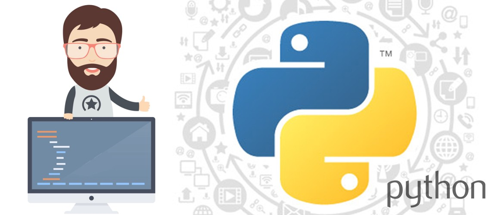
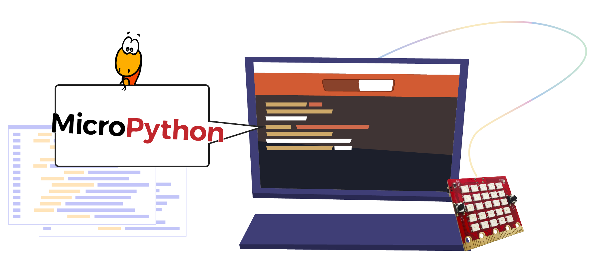

Giới thiệu
=============================================

Python là một ngôn ngữ lập trình rất thân thiện với người dùng và được sử dụng bởi rất nhiều người mới làm quen với lập trình. Ngoài ra Python cũng được sử dụng bởi một số lượng lớn các chuyên gia trong lĩnh vực khoa học dữ liệu và trí tuệ nhân tạo đang ngày càng phổ biến trong cuộc cách mạng công nghiệp 4.0 hiện nay.

Trái ngược với lập trình dùng các khối lệnh kéo thả, lập trình Python chủ yếu dùng các dòng lệnh dạng text (chữ viết). Khi mới nhìn qua thì bạn sẽ có cảm giác hơi sợ, nhưng đi qua một vài hướng dẫn trong giáo trình này và thêm một chút thực hành, bạn sẽ thấy ai cũng có thể lập trình được.

Phiên bản Python mà Yolo:Bit đang sử dụng được gọi là MicroPython. Đây là phiên bản được sửa đổi lại từ phiên bản Python gốc giúp chạy được trên một thiết bị nhỏ với bộ nhớ ít và tốc độ chậm hơn nhiều so với máy tính thông thường.

Giáo trình này sẽ hướng dẫn bạn làm quen lập trình dạng text với MicroPython và sử dụng tất cả các tính năng sẵn có trên Yolo:Bit.