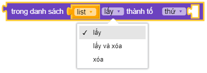
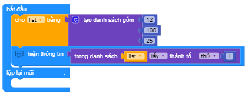
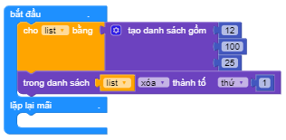

Lấy giá trị - Xóa giá trị thành phần trong danh sách
==========

Ví dụ
----------------------

In ra màn hình giá trị thành phần thứ nhất trong mảng

In ra màn hình giá trị thành phần thứ nhất trong mảng và xóa nó

.. image:: images/ad-list-vd-7-2.png
    :scale: 100 %
    :align: center

Xóa thành phần thứ nhất trong mảng

