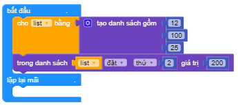
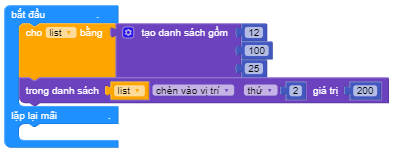

Thay thế và thêm thành phần vào danh sách
==========

.. image:: images/ad-list-8.png
    :scale: 100 %
    :align: center

Ví dụ
----------------------

Thay giá trị của thành phần thứ 2 từ 100 sang 200

Chèn thành phần có giá trị 200 vào vị trí thứ 2 trong mảng

