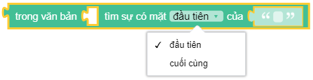
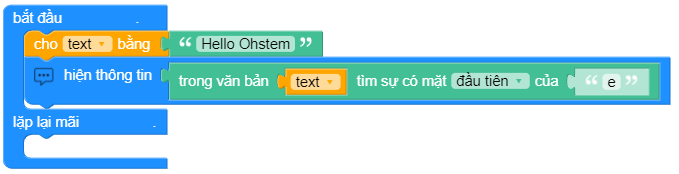

Tìm vị trí đầu/cuối của một kí trong văn bản
==========

Hoàn trả là giá trị số (int) là vị trí đầu/cuối của đầu vào 2 trong đầu vào 1

Ví dụ
----------------------

Tìm vị trị kí tự ``e`` trong văn bản "Hello Ohstem". Kết quả trả về từ đoạn code này là 2

